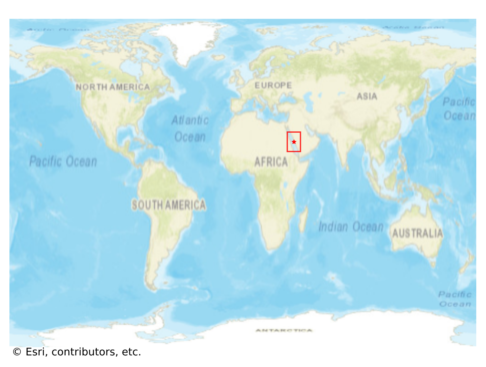
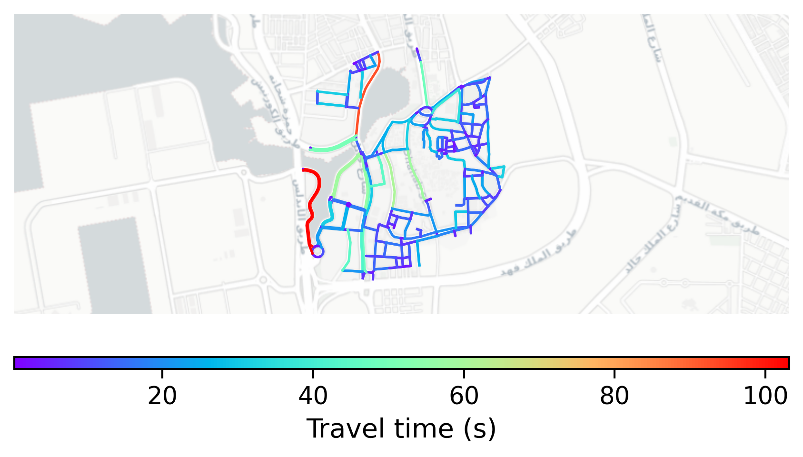

# Jeddah_Historic_District, Saudi Arabia

#### Location Information

- **City**: Jeddah_Historic_District
- **Country**: Saudi Arabia
- **Data Source**: OpenStreetMap

- **Analysis Date**: 2025-10-10

#### Road network topology

#### Network Characteristics

##### Basic Topology

- **Number of Nodes**: 200
- **Number of Edges**: 443
- **Network Density**: 0.011131
- **Average Node Degree**: 4.430
- **Standard Deviation of Node Degrees**: 1.611

##### Clustering Properties

- **Global Clustering Coefficient**: 0.051546
- **Average Local Clustering Coefficient**: 0.043063
- **Degree Assortativity Coefficient**: 0.386255

##### Spatial Metrics

- **Total Network Length (meters)**: 47818.41
- **Average Edge Length (meters)**: 107.94
- **Average Travel Time per Edge (seconds)**: 12.95

---
*Report generated on 2025-10-10 18:28:35*
