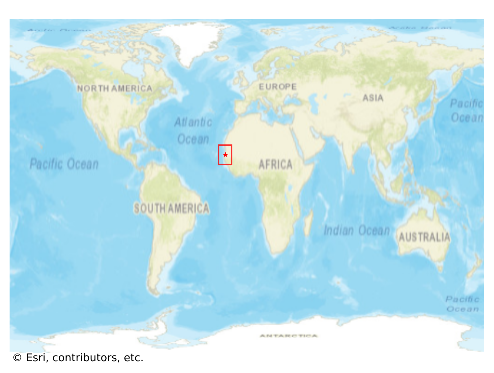
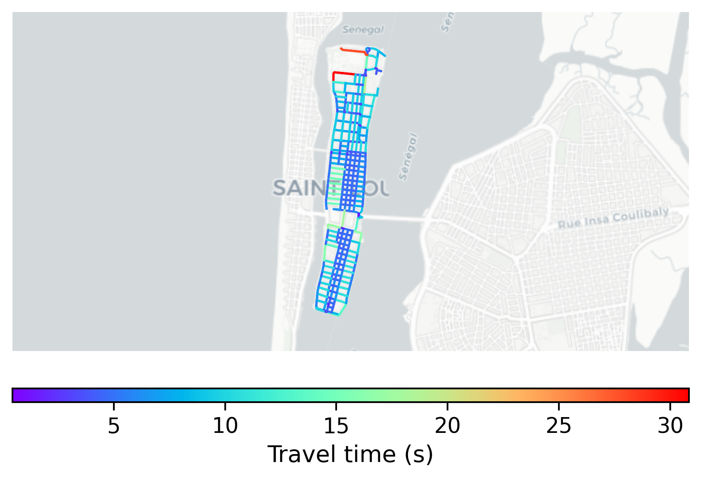

# SaintLouis_Island, Senegal

#### Location Information

- **City**: SaintLouis_Island
- **Country**: Senegal
- **Data Source**: OpenStreetMap

- **Analysis Date**: 2025-10-09

#### Road network topology

#### Network Characteristics

##### Basic Topology

- **Number of Nodes**: 247
- **Number of Edges**: 739
- **Network Density**: 0.012162
- **Average Node Degree**: 5.984
- **Standard Deviation of Node Degrees**: 1.459

##### Clustering Properties

- **Global Clustering Coefficient**: 0.008483
- **Average Local Clustering Coefficient**: 0.010460
- **Degree Assortativity Coefficient**: 0.405858

##### Spatial Metrics

- **Total Network Length (meters)**: 39498.70
- **Average Edge Length (meters)**: 53.45
- **Average Travel Time per Edge (seconds)**: 6.41

---
*Report generated on 2025-10-09 19:20:49*
