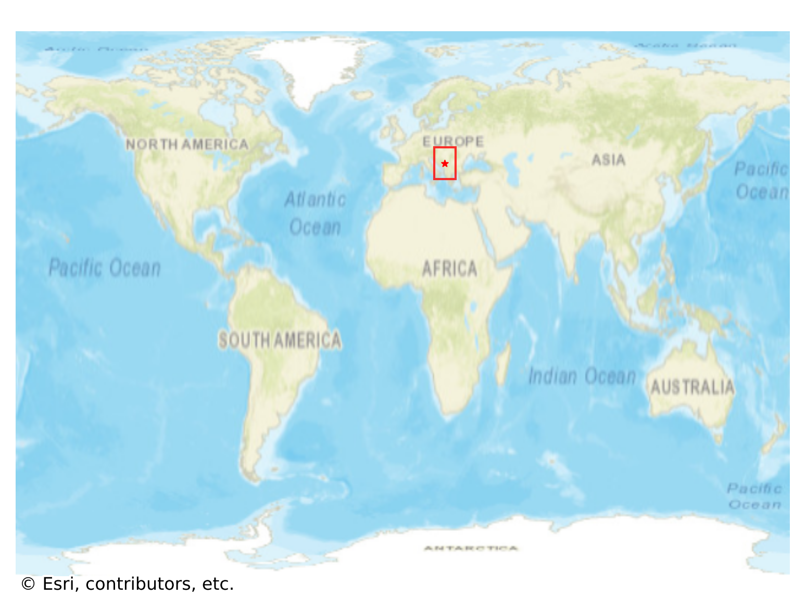
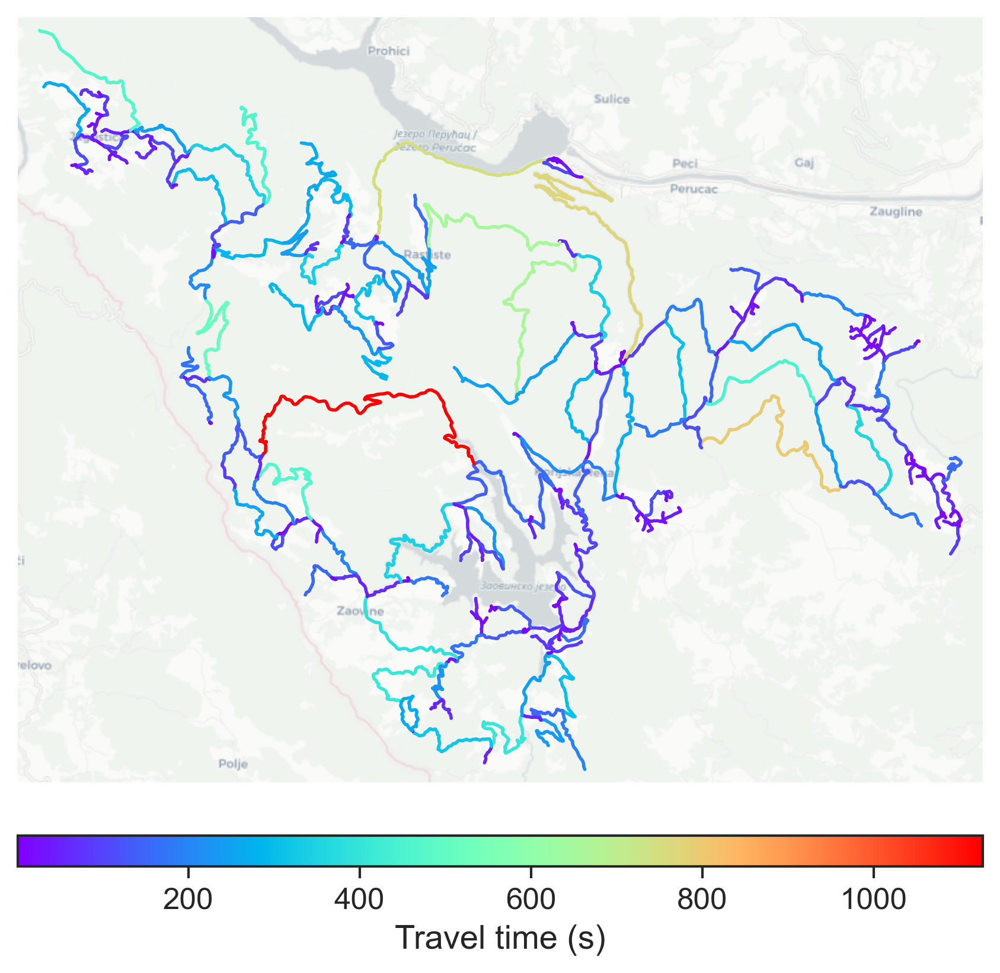

# Tara, Serbia

#### Location Information

- **City**: Tara
- **Country**: Serbia
- **Data Source**: OpenStreetMap

- **Analysis Date**: 2025-10-10

#### Road network topology

#### Network Characteristics

##### Basic Topology

- **Number of Nodes**: 302
- **Number of Edges**: 676
- **Network Density**: 0.007437
- **Average Node Degree**: 4.477
- **Standard Deviation of Node Degrees**: 1.929

##### Clustering Properties

- **Global Clustering Coefficient**: 0.039474
- **Average Local Clustering Coefficient**: 0.043630
- **Degree Assortativity Coefficient**: -0.209068

##### Spatial Metrics

- **Total Network Length (meters)**: 599217.07
- **Average Edge Length (meters)**: 886.42
- **Average Travel Time per Edge (seconds)**: 99.19

---
*Report generated on 2025-10-10 18:28:39*
