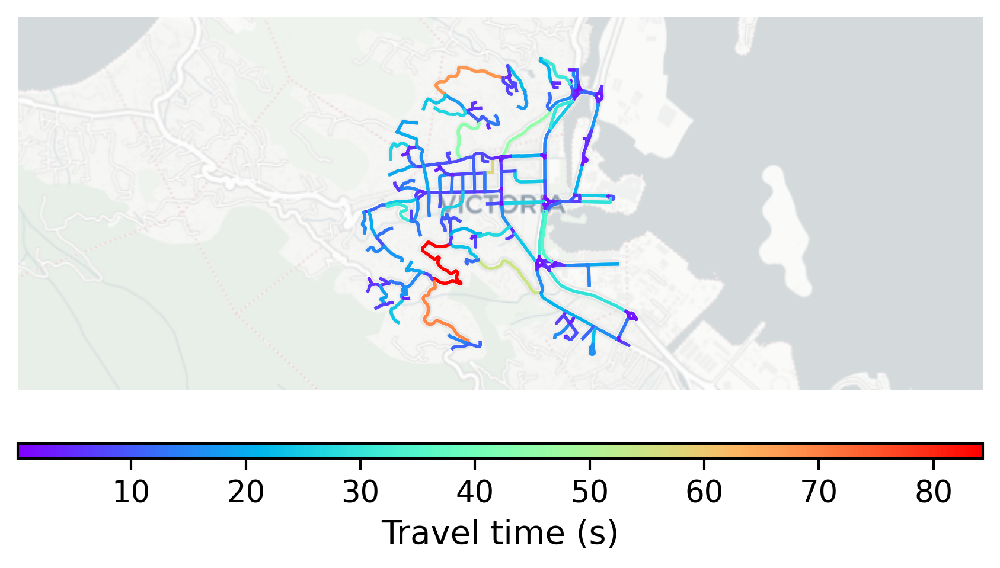

# Victoria, Seychelles

#### Location Information

- **City**: Victoria
- **Country**: Seychelles
- **Data Source**: OpenStreetMap

- **Analysis Date**: 2025-10-10

#### Road network topology

#### Network Characteristics

##### Basic Topology

- **Number of Nodes**: 238
- **Number of Edges**: 483
- **Network Density**: 0.008563
- **Average Node Degree**: 4.059
- **Standard Deviation of Node Degrees**: 1.694

##### Clustering Properties

- **Global Clustering Coefficient**: 0.152727
- **Average Local Clustering Coefficient**: 0.148674
- **Degree Assortativity Coefficient**: 0.013087

##### Spatial Metrics

- **Total Network Length (meters)**: 55214.68
- **Average Edge Length (meters)**: 114.32
- **Average Travel Time per Edge (seconds)**: 10.83

---
*Report generated on 2025-10-10 18:28:41*
