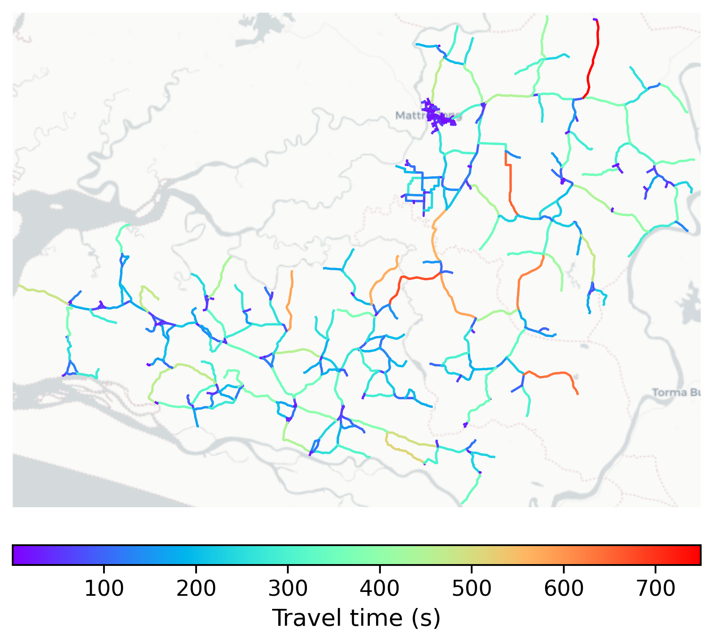

# Bonthe, Sierra Leone

#### Location Information

- **City**: Bonthe
- **Country**: Sierra Leone
- **Data Source**: OpenStreetMap

- **Analysis Date**: 2025-10-10

#### Road network topology

#### Network Characteristics

##### Basic Topology

- **Number of Nodes**: 426
- **Number of Edges**: 1,020
- **Network Density**: 0.005634
- **Average Node Degree**: 4.789
- **Standard Deviation of Node Degrees**: 2.078

##### Clustering Properties

- **Global Clustering Coefficient**: 0.068553
- **Average Local Clustering Coefficient**: 0.068802
- **Degree Assortativity Coefficient**: -0.127205

##### Spatial Metrics

- **Total Network Length (meters)**: 1104093.14
- **Average Edge Length (meters)**: 1082.44
- **Average Travel Time per Edge (seconds)**: 129.89

---
*Report generated on 2025-10-10 16:11:25*
