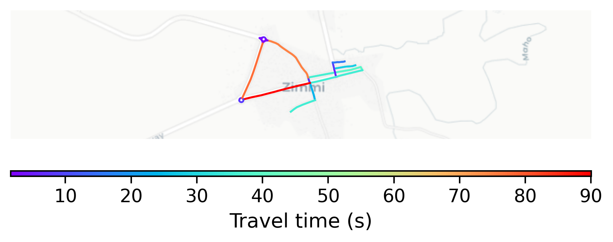

# Zimmi, Sierra Leone

#### Location Information

- **City**: Zimmi
- **Country**: Sierra Leone
- **Data Source**: OpenStreetMap

- **Analysis Date**: 2025-10-10

#### Road network topology

#### Network Characteristics

##### Basic Topology

- **Number of Nodes**: 23
- **Number of Edges**: 45
- **Network Density**: 0.088933
- **Average Node Degree**: 3.913
- **Standard Deviation of Node Degrees**: 1.742

##### Clustering Properties

- **Global Clustering Coefficient**: 0.267857
- **Average Local Clustering Coefficient**: 0.341667
- **Degree Assortativity Coefficient**: 0.342380

##### Spatial Metrics

- **Total Network Length (meters)**: 9095.14
- **Average Edge Length (meters)**: 202.11
- **Average Travel Time per Edge (seconds)**: 24.25

---
*Report generated on 2025-10-10 18:28:44*
