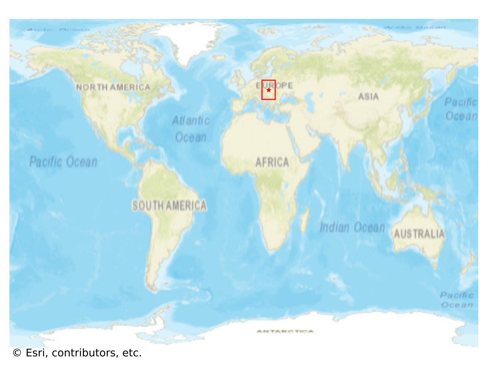

# Banska_Štiavnica, Slovakia

#### Location Information

- **City**: Banska_Štiavnica
- **Country**: Slovakia
- **Data Source**: OpenStreetMap

- **Analysis Date**: 2025-10-09

#### Road network topology

#### Network Characteristics

##### Basic Topology

- **Number of Nodes**: 444
- **Number of Edges**: 1,021
- **Network Density**: 0.005191
- **Average Node Degree**: 4.599
- **Standard Deviation of Node Degrees**: 1.875

##### Clustering Properties

- **Global Clustering Coefficient**: 0.079618
- **Average Local Clustering Coefficient**: 0.077381
- **Degree Assortativity Coefficient**: -0.089312

##### Spatial Metrics

- **Total Network Length (meters)**: 169420.71
- **Average Edge Length (meters)**: 165.94
- **Average Travel Time per Edge (seconds)**: 18.73

---
*Report generated on 2025-10-09 19:20:55*
