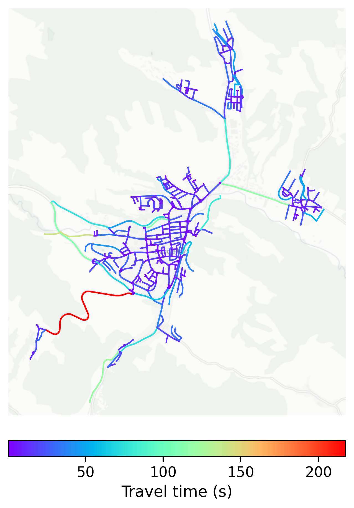

# Bardejov, Slovakia

#### Location Information

- **City**: Bardejov
- **Country**: Slovakia
- **Data Source**: OpenStreetMap

- **Analysis Date**: 2025-10-10

#### Road network topology

#### Network Characteristics

##### Basic Topology

- **Number of Nodes**: 506
- **Number of Edges**: 1,129
- **Network Density**: 0.004418
- **Average Node Degree**: 4.462
- **Standard Deviation of Node Degrees**: 1.803

##### Clustering Properties

- **Global Clustering Coefficient**: 0.107492
- **Average Local Clustering Coefficient**: 0.099653
- **Degree Assortativity Coefficient**: 0.033047

##### Spatial Metrics

- **Total Network Length (meters)**: 183702.10
- **Average Edge Length (meters)**: 162.71
- **Average Travel Time per Edge (seconds)**: 13.00

---
*Report generated on 2025-10-10 16:11:34*
