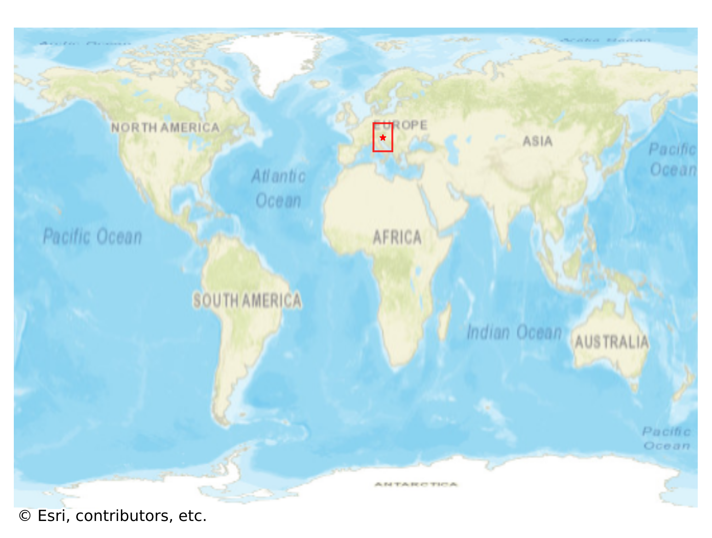

# Bled, Slovenia

#### Location Information

- **City**: Bled
- **Country**: Slovenia
- **Data Source**: OpenStreetMap

- **Analysis Date**: 2025-10-10

#### Road network topology

#### Network Characteristics

##### Basic Topology

- **Number of Nodes**: 618
- **Number of Edges**: 1,404
- **Network Density**: 0.003682
- **Average Node Degree**: 4.544
- **Standard Deviation of Node Degrees**: 1.994

##### Clustering Properties

- **Global Clustering Coefficient**: 0.055511
- **Average Local Clustering Coefficient**: 0.056667
- **Degree Assortativity Coefficient**: -0.159819

##### Spatial Metrics

- **Total Network Length (meters)**: 219118.98
- **Average Edge Length (meters)**: 156.07
- **Average Travel Time per Edge (seconds)**: 16.23

---
*Report generated on 2025-10-10 18:28:51*
