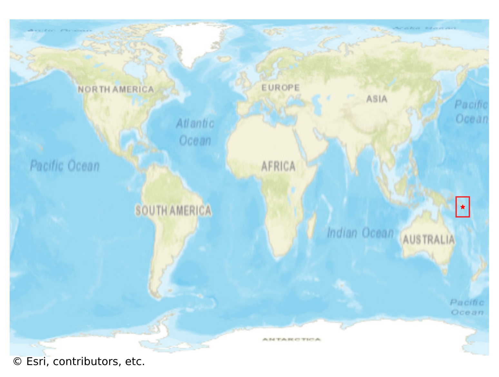
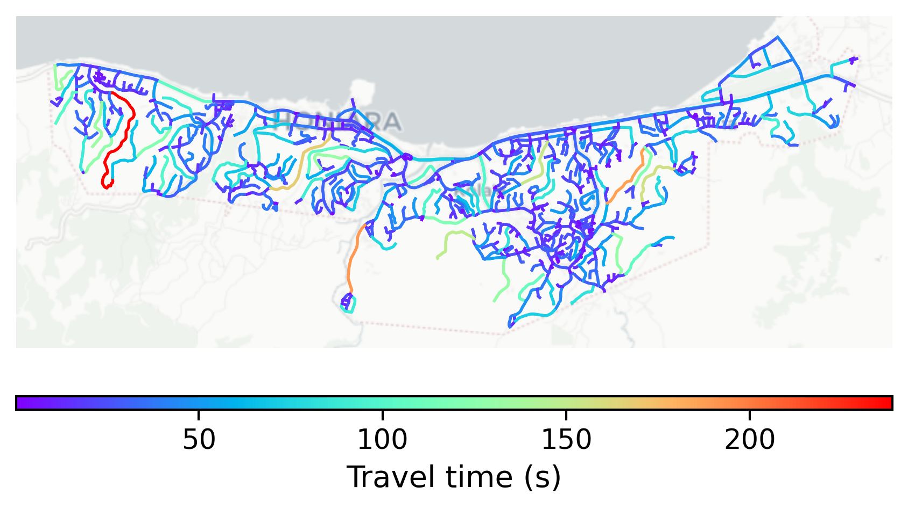

# Honiara, Solomon Islands

#### Location Information

- **City**: Honiara
- **Country**: Solomon Islands
- **Data Source**: OpenStreetMap

- **Analysis Date**: 2025-10-10

#### Road network topology

#### Network Characteristics

##### Basic Topology

- **Number of Nodes**: 890
- **Number of Edges**: 1,906
- **Network Density**: 0.002409
- **Average Node Degree**: 4.283
- **Standard Deviation of Node Degrees**: 1.971

##### Clustering Properties

- **Global Clustering Coefficient**: 0.034642
- **Average Local Clustering Coefficient**: 0.035152
- **Degree Assortativity Coefficient**: -0.189583

##### Spatial Metrics

- **Total Network Length (meters)**: 309483.40
- **Average Edge Length (meters)**: 162.37
- **Average Travel Time per Edge (seconds)**: 25.85

---
*Report generated on 2025-10-10 18:28:54*
