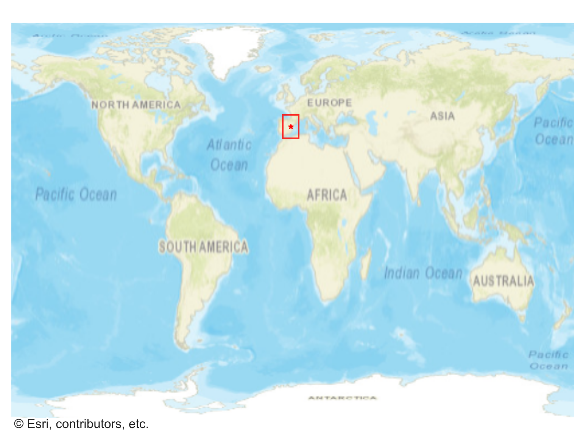
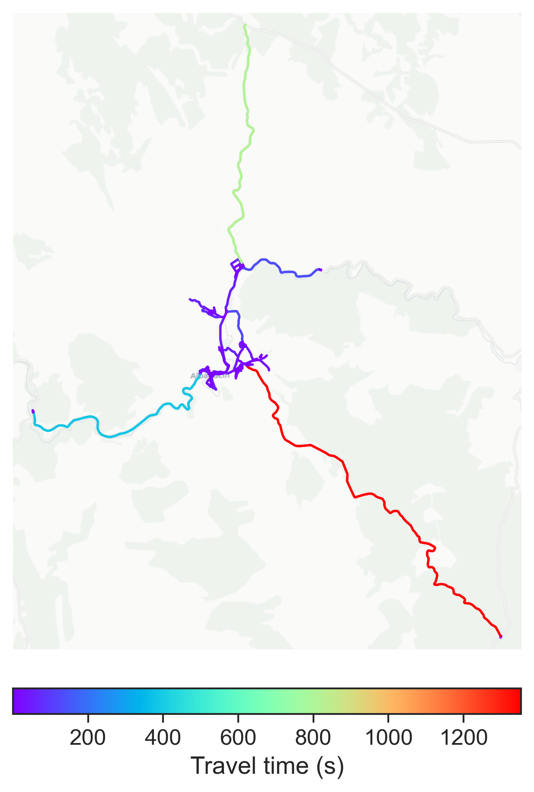

# Albarracín, Spain

#### Location Information

- **City**: Albarracín
- **Country**: Spain
- **Data Source**: OpenStreetMap

- **Analysis Date**: 2025-10-10

#### Road network topology

#### Network Characteristics

##### Basic Topology

- **Number of Nodes**: 169
- **Number of Edges**: 376
- **Network Density**: 0.013243
- **Average Node Degree**: 4.450
- **Standard Deviation of Node Degrees**: 1.820

##### Clustering Properties

- **Global Clustering Coefficient**: 0.117801
- **Average Local Clustering Coefficient**: 0.124000
- **Degree Assortativity Coefficient**: 0.027869

##### Spatial Metrics

- **Total Network Length (meters)**: 90653.30
- **Average Edge Length (meters)**: 241.10
- **Average Travel Time per Edge (seconds)**: 24.98

---
*Report generated on 2025-10-10 16:11:46*
