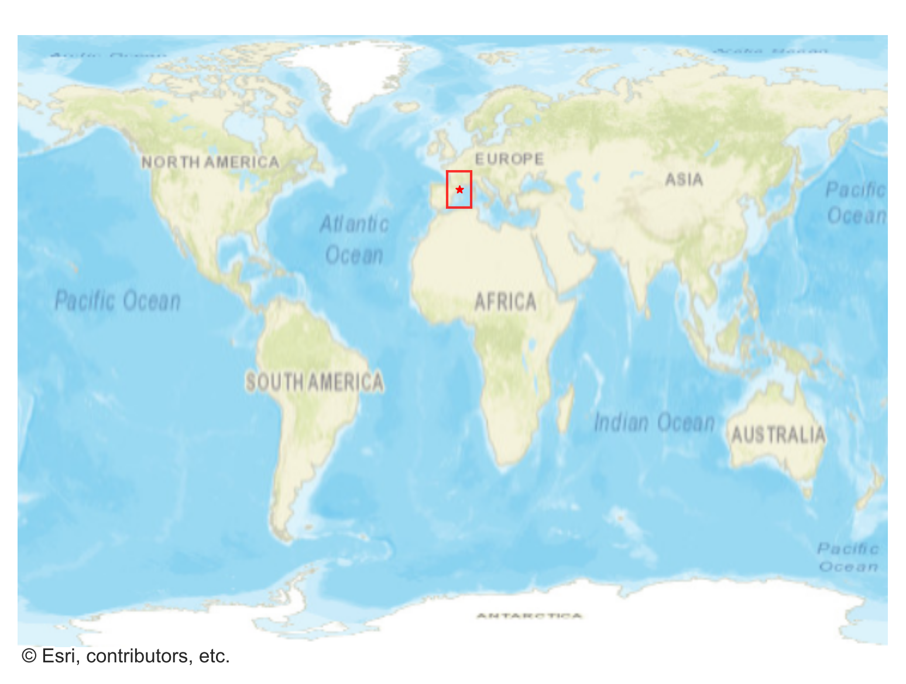
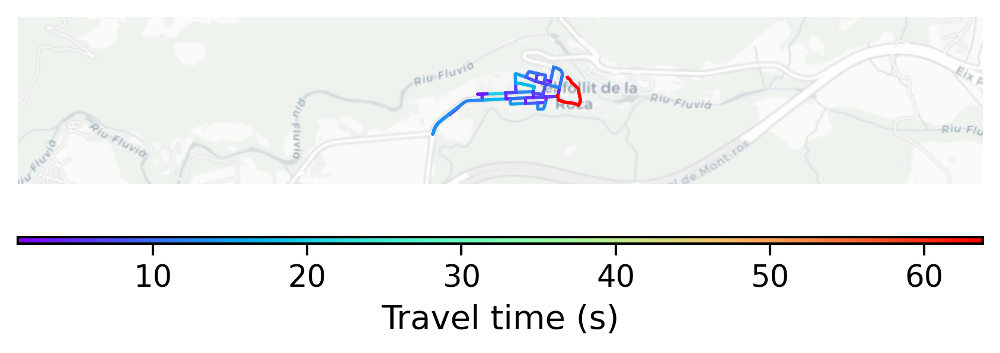

# Castellfollit_de_la_Roca, Spain

#### Location Information

- **City**: Castellfollit_de_la_Roca
- **Country**: Spain
- **Data Source**: OpenStreetMap

- **Analysis Date**: 2025-10-09

#### Road network topology

#### Network Characteristics

##### Basic Topology

- **Number of Nodes**: 34
- **Number of Edges**: 78
- **Network Density**: 0.069519
- **Average Node Degree**: 4.588
- **Standard Deviation of Node Degrees**: 1.375

##### Clustering Properties

- **Global Clustering Coefficient**: 0.142857
- **Average Local Clustering Coefficient**: 0.166667
- **Degree Assortativity Coefficient**: 0.184245

##### Spatial Metrics

- **Total Network Length (meters)**: 6037.64
- **Average Edge Length (meters)**: 77.41
- **Average Travel Time per Edge (seconds)**: 9.25

---
*Report generated on 2025-10-09 19:21:02*
