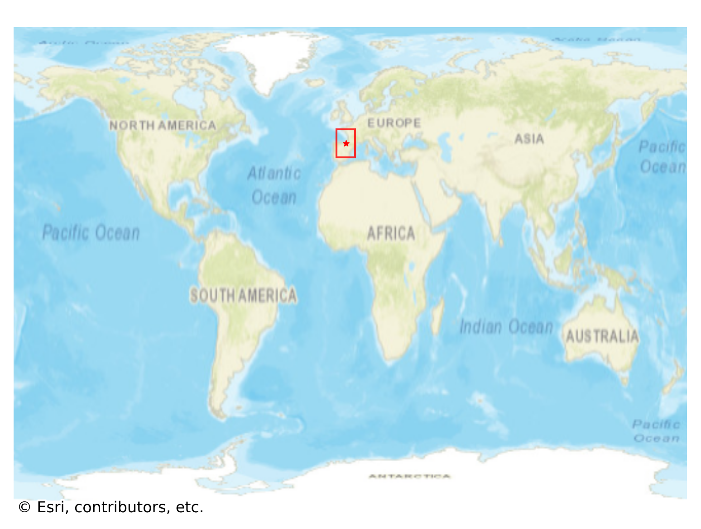
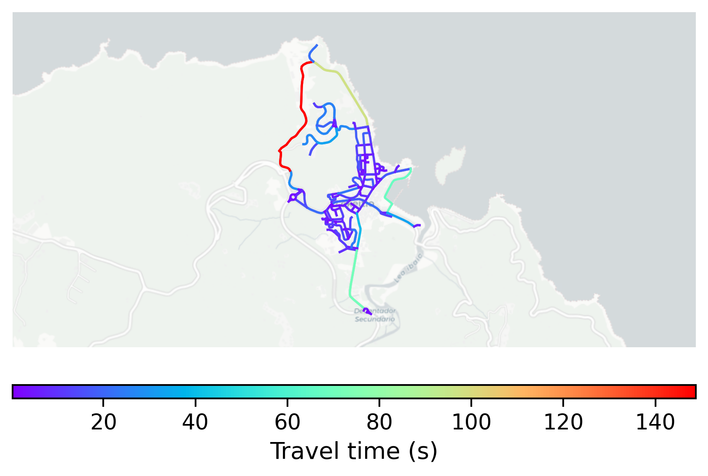

# Lekeitio, Spain

#### Location Information

- **City**: Lekeitio
- **Country**: Spain
- **Data Source**: OpenStreetMap

- **Analysis Date**: 2025-10-10

#### Road network topology

#### Network Characteristics

##### Basic Topology

- **Number of Nodes**: 158
- **Number of Edges**: 307
- **Network Density**: 0.012376
- **Average Node Degree**: 3.886
- **Standard Deviation of Node Degrees**: 1.326

##### Clustering Properties

- **Global Clustering Coefficient**: 0.100719
- **Average Local Clustering Coefficient**: 0.116788
- **Degree Assortativity Coefficient**: -0.004518

##### Spatial Metrics

- **Total Network Length (meters)**: 26125.44
- **Average Edge Length (meters)**: 85.10
- **Average Travel Time per Edge (seconds)**: 10.21

---
*Report generated on 2025-10-10 18:29:02*
