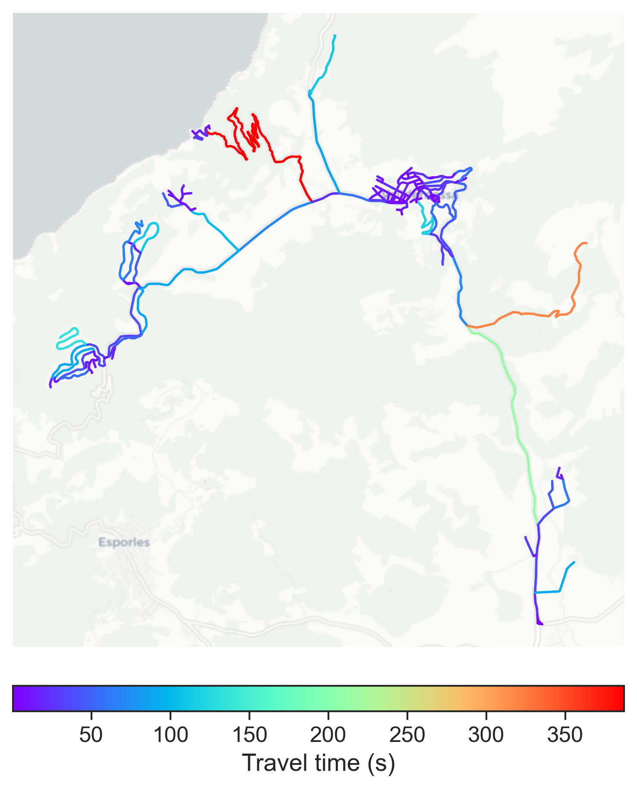

# Valldemossa, Spain

#### Location Information

- **City**: Valldemossa
- **Country**: Spain
- **Data Source**: OpenStreetMap

- **Analysis Date**: 2025-10-09

#### Road network topology

#### Network Characteristics

##### Basic Topology

- **Number of Nodes**: 167
- **Number of Edges**: 399
- **Network Density**: 0.014393
- **Average Node Degree**: 4.778
- **Standard Deviation of Node Degrees**: 1.865

##### Clustering Properties

- **Global Clustering Coefficient**: 0.062500
- **Average Local Clustering Coefficient**: 0.066931
- **Degree Assortativity Coefficient**: 0.009682

##### Spatial Metrics

- **Total Network Length (meters)**: 98283.39
- **Average Edge Length (meters)**: 246.32
- **Average Travel Time per Edge (seconds)**: 24.43

---
*Report generated on 2025-10-09 19:21:07*
