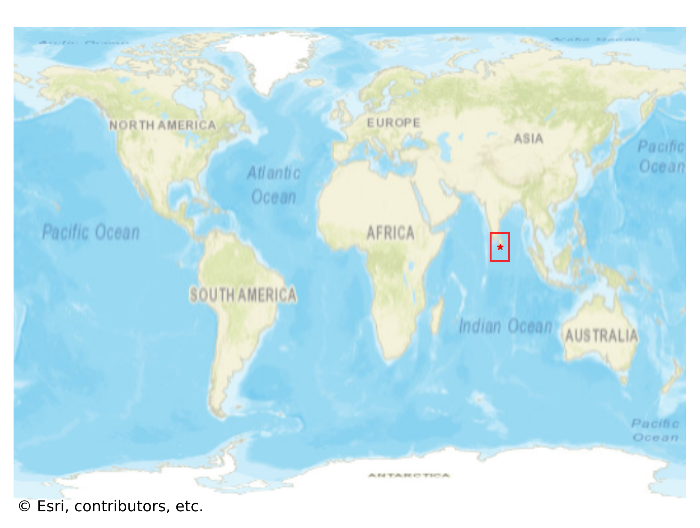
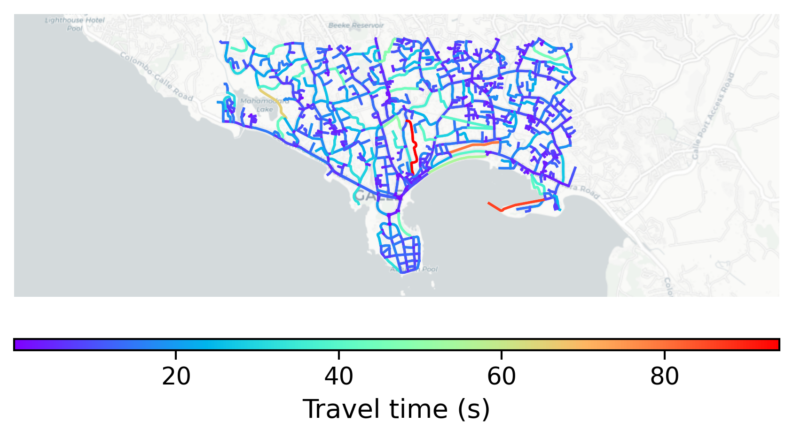

# Galle_Fort, Sri Lanka

#### Location Information

- **City**: Galle_Fort
- **Country**: Sri Lanka
- **Data Source**: OpenStreetMap

- **Analysis Date**: 2025-10-10

#### Road network topology

#### Network Characteristics

##### Basic Topology

- **Number of Nodes**: 947
- **Number of Edges**: 2,166
- **Network Density**: 0.002418
- **Average Node Degree**: 4.574
- **Standard Deviation of Node Degrees**: 1.914

##### Clustering Properties

- **Global Clustering Coefficient**: 0.053059
- **Average Local Clustering Coefficient**: 0.050909
- **Degree Assortativity Coefficient**: -0.041881

##### Spatial Metrics

- **Total Network Length (meters)**: 190920.85
- **Average Edge Length (meters)**: 88.14
- **Average Travel Time per Edge (seconds)**: 9.51

---
*Report generated on 2025-10-10 16:12:00*
