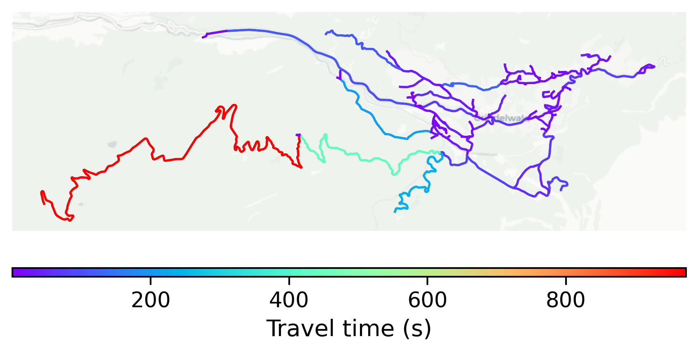

# Grindelwald, Switzerland

#### Location Information

- **City**: Grindelwald
- **Country**: Switzerland
- **Data Source**: OpenStreetMap

- **Analysis Date**: 2025-10-10

#### Road network topology

#### Network Characteristics

##### Basic Topology

- **Number of Nodes**: 114
- **Number of Edges**: 250
- **Network Density**: 0.019407
- **Average Node Degree**: 4.386
- **Standard Deviation of Node Degrees**: 1.866

##### Clustering Properties

- **Global Clustering Coefficient**: 0.084112
- **Average Local Clustering Coefficient**: 0.080000
- **Degree Assortativity Coefficient**: -0.133333

##### Spatial Metrics

- **Total Network Length (meters)**: 95719.61
- **Average Edge Length (meters)**: 382.88
- **Average Travel Time per Edge (seconds)**: 37.86

---
*Report generated on 2025-10-10 18:29:32*
