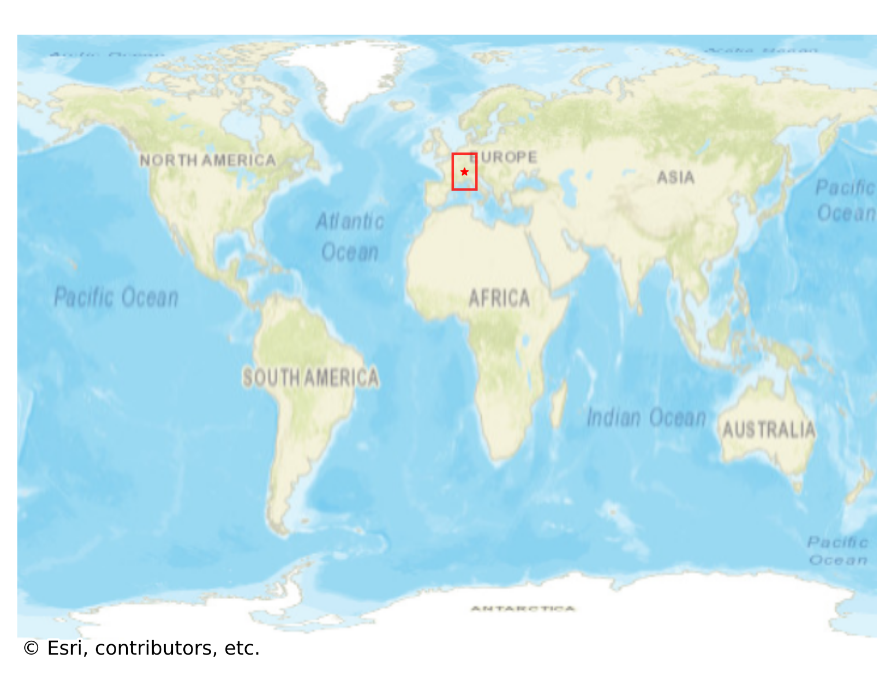
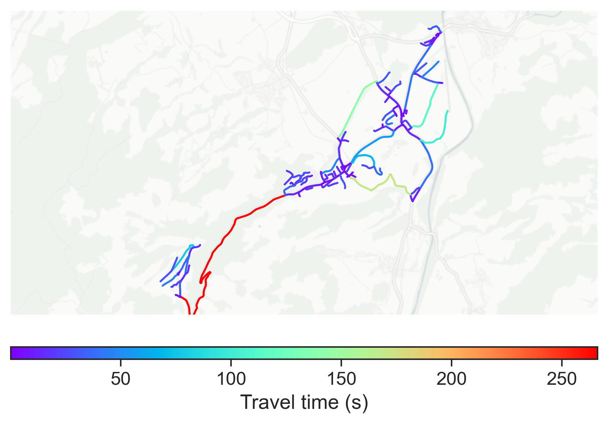

# Gruyères, Switzerland

#### Location Information

- **City**: Gruyères
- **Country**: Switzerland
- **Data Source**: OpenStreetMap

- **Analysis Date**: 2025-10-10

#### Road network topology

#### Network Characteristics

##### Basic Topology

- **Number of Nodes**: 144
- **Number of Edges**: 291
- **Network Density**: 0.014132
- **Average Node Degree**: 4.042
- **Standard Deviation of Node Degrees**: 1.814

##### Clustering Properties

- **Global Clustering Coefficient**: 0.101124
- **Average Local Clustering Coefficient**: 0.109929
- **Degree Assortativity Coefficient**: -0.086877

##### Spatial Metrics

- **Total Network Length (meters)**: 58290.53
- **Average Edge Length (meters)**: 200.31
- **Average Travel Time per Edge (seconds)**: 19.97

---
*Report generated on 2025-10-10 16:12:07*
