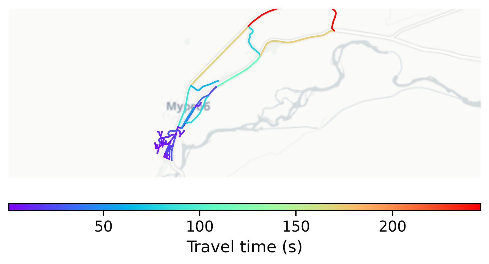

# Murgab, Tajikistan

#### Location Information

- **City**: Murgab
- **Country**: Tajikistan
- **Data Source**: OpenStreetMap

- **Analysis Date**: 2025-10-09

#### Road network topology

#### Network Characteristics

##### Basic Topology

- **Number of Nodes**: 59
- **Number of Edges**: 146
- **Network Density**: 0.042665
- **Average Node Degree**: 4.949
- **Standard Deviation of Node Degrees**: 1.661

##### Clustering Properties

- **Global Clustering Coefficient**: 0.164062
- **Average Local Clustering Coefficient**: 0.191489
- **Degree Assortativity Coefficient**: -0.183967

##### Spatial Metrics

- **Total Network Length (meters)**: 27572.53
- **Average Edge Length (meters)**: 188.85
- **Average Travel Time per Edge (seconds)**: 22.66

---
*Report generated on 2025-10-09 19:21:18*
