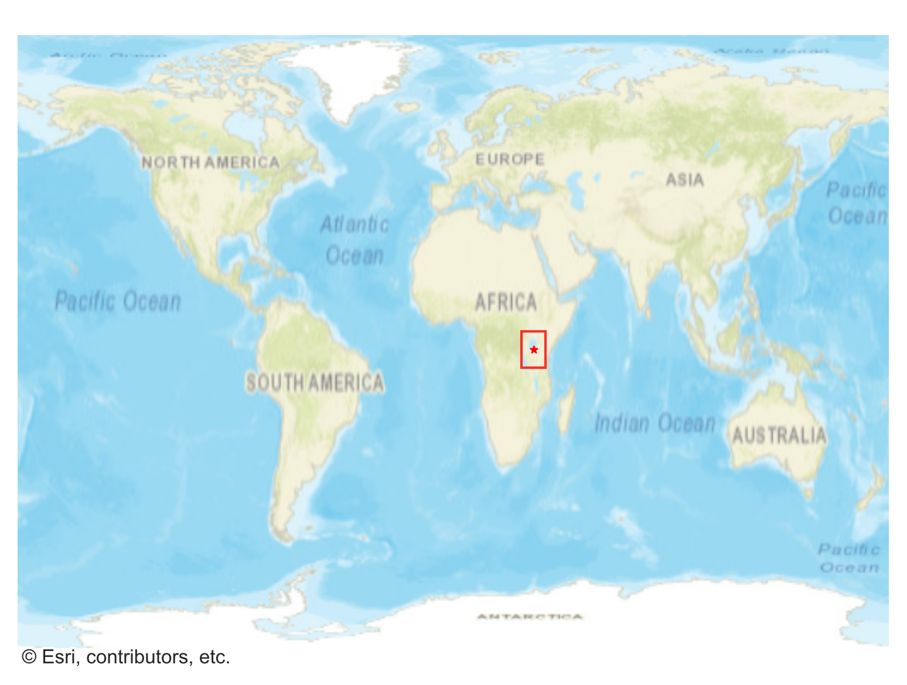
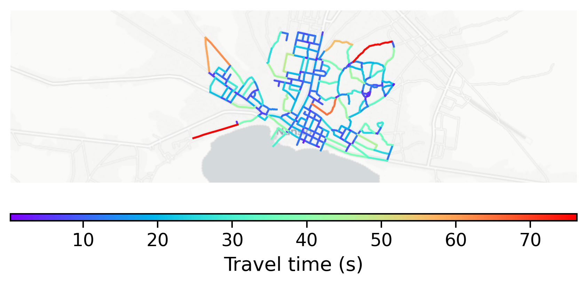

# Nansio, Tanzania

#### Location Information

- **City**: Nansio
- **Country**: Tanzania
- **Data Source**: OpenStreetMap

- **Analysis Date**: 2025-10-10

#### Road network topology

#### Network Characteristics

##### Basic Topology

- **Number of Nodes**: 211
- **Number of Edges**: 608
- **Network Density**: 0.013722
- **Average Node Degree**: 5.763
- **Standard Deviation of Node Degrees**: 1.444

##### Clustering Properties

- **Global Clustering Coefficient**: 0.062903
- **Average Local Clustering Coefficient**: 0.059585
- **Degree Assortativity Coefficient**: 0.160405

##### Spatial Metrics

- **Total Network Length (meters)**: 77821.05
- **Average Edge Length (meters)**: 128.00
- **Average Travel Time per Edge (seconds)**: 15.36

---
*Report generated on 2025-10-10 16:12:11*
