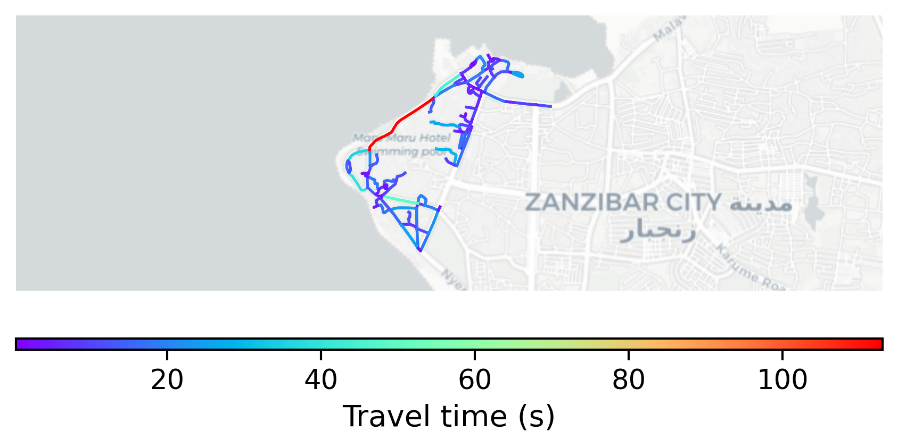

# Stone_Town, Tanzania

#### Location Information

- **City**: Stone_Town
- **Country**: Tanzania
- **Data Source**: OpenStreetMap

- **Analysis Date**: 2025-10-10

#### Road network topology

#### Network Characteristics

##### Basic Topology

- **Number of Nodes**: 110
- **Number of Edges**: 254
- **Network Density**: 0.021184
- **Average Node Degree**: 4.618
- **Standard Deviation of Node Degrees**: 1.607

##### Clustering Properties

- **Global Clustering Coefficient**: 0.112033
- **Average Local Clustering Coefficient**: 0.099251
- **Degree Assortativity Coefficient**: 0.129713

##### Spatial Metrics

- **Total Network Length (meters)**: 19421.52
- **Average Edge Length (meters)**: 76.46
- **Average Travel Time per Edge (seconds)**: 9.83

---
*Report generated on 2025-10-10 18:29:39*
