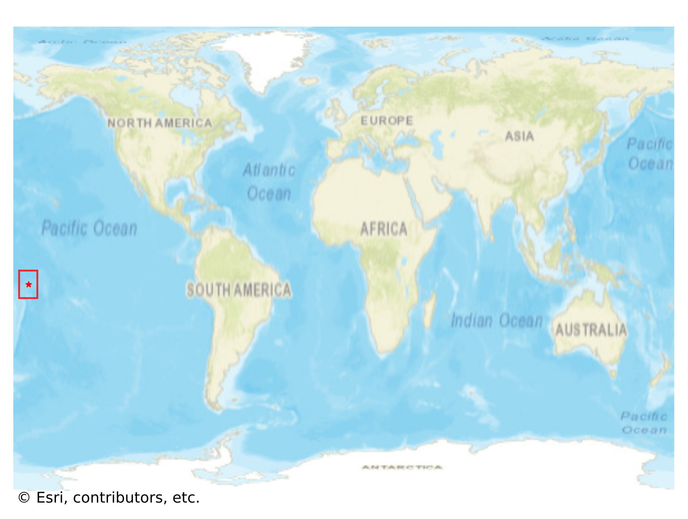

# Tokelau, Tokelau

#### Location Information

- **City**: Tokelau
- **Country**: Tokelau
- **Data Source**: OpenStreetMap

- **Analysis Date**: 2025-10-10

#### Road network topology

#### Network Characteristics

##### Basic Topology

- **Number of Nodes**: 24
- **Number of Edges**: 72
- **Network Density**: 0.130435
- **Average Node Degree**: 6.000
- **Standard Deviation of Node Degrees**: 1.732

##### Clustering Properties

- **Global Clustering Coefficient**: 0.148148
- **Average Local Clustering Coefficient**: 0.142857
- **Degree Assortativity Coefficient**: -0.079365

##### Spatial Metrics

- **Total Network Length (meters)**: 8997.85
- **Average Edge Length (meters)**: 124.97
- **Average Travel Time per Edge (seconds)**: 15.00

---
*Report generated on 2025-10-10 16:12:15*
