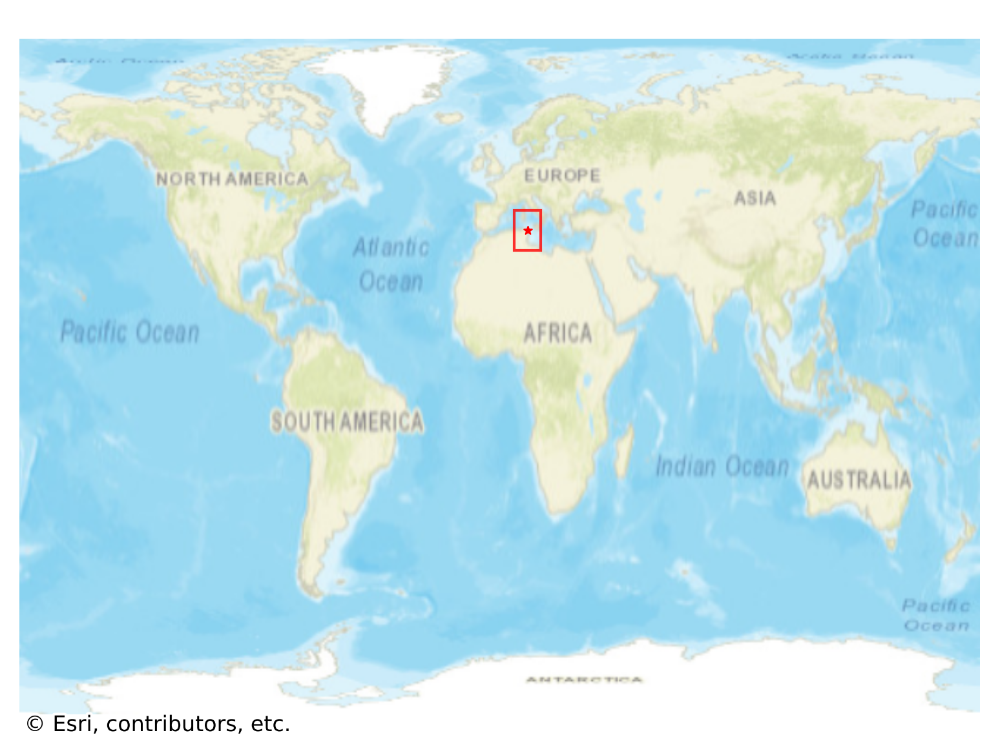
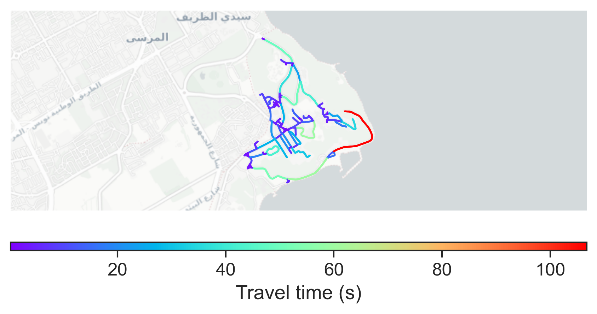

# Sidi_Bou_Said, Tunisia

#### Location Information

- **City**: Sidi_Bou_Said
- **Country**: Tunisia
- **Data Source**: OpenStreetMap

- **Analysis Date**: 2025-10-10

#### Road network topology

#### Network Characteristics

##### Basic Topology

- **Number of Nodes**: 117
- **Number of Edges**: 242
- **Network Density**: 0.017831
- **Average Node Degree**: 4.137
- **Standard Deviation of Node Degrees**: 1.606

##### Clustering Properties

- **Global Clustering Coefficient**: 0.161826
- **Average Local Clustering Coefficient**: 0.170543
- **Degree Assortativity Coefficient**: -0.071135

##### Spatial Metrics

- **Total Network Length (meters)**: 21467.36
- **Average Edge Length (meters)**: 88.71
- **Average Travel Time per Edge (seconds)**: 10.64

---
*Report generated on 2025-10-10 16:12:17*
