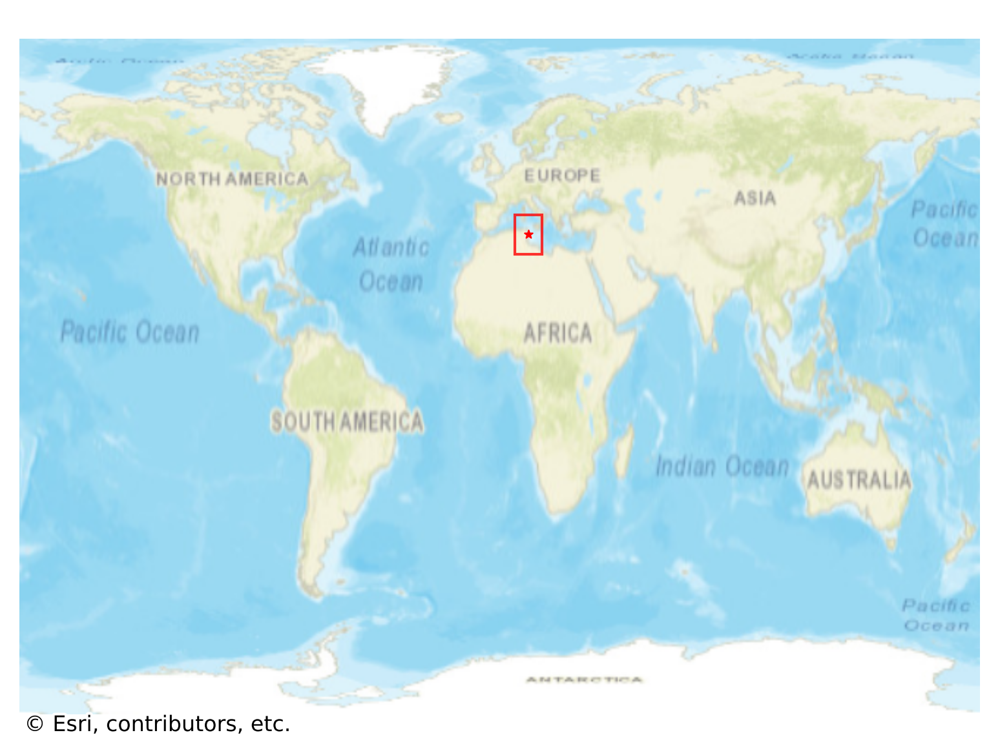
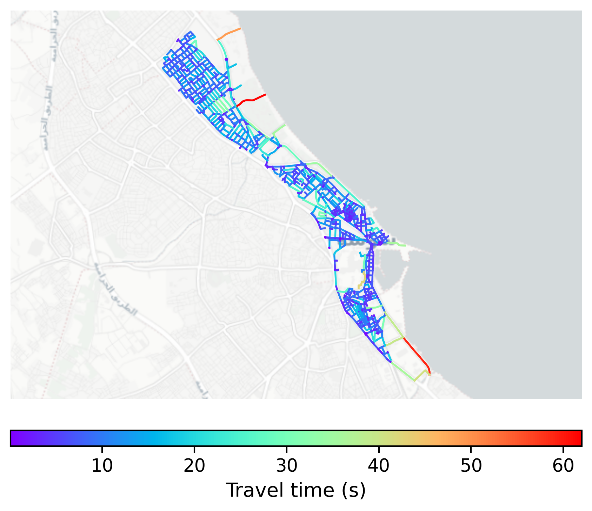

# Sousse_Medina, Tunisia

#### Location Information

- **City**: Sousse_Medina
- **Country**: Tunisia
- **Data Source**: OpenStreetMap

- **Analysis Date**: 2025-10-10

#### Road network topology

#### Network Characteristics

##### Basic Topology

- **Number of Nodes**: 916
- **Number of Edges**: 2,279
- **Network Density**: 0.002719
- **Average Node Degree**: 4.976
- **Standard Deviation of Node Degrees**: 1.775

##### Clustering Properties

- **Global Clustering Coefficient**: 0.045038
- **Average Local Clustering Coefficient**: 0.047333
- **Degree Assortativity Coefficient**: 0.409444

##### Spatial Metrics

- **Total Network Length (meters)**: 153726.58
- **Average Edge Length (meters)**: 67.45
- **Average Travel Time per Edge (seconds)**: 7.62

---
*Report generated on 2025-10-10 16:12:20*
