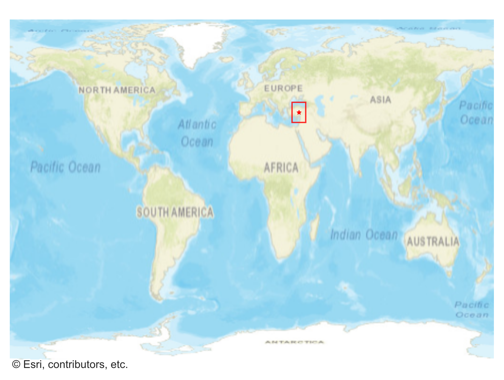
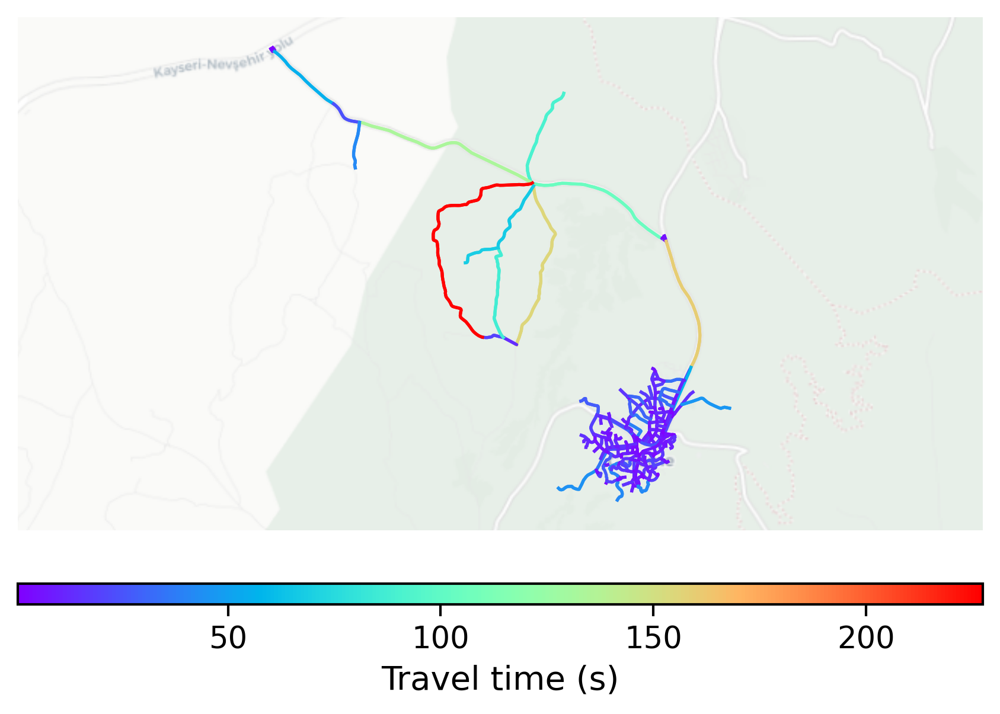

# Goreme, Turkey

#### Location Information

- **City**: Goreme
- **Country**: Turkey
- **Data Source**: OpenStreetMap

- **Analysis Date**: 2025-10-10

#### Road network topology

#### Network Characteristics

##### Basic Topology

- **Number of Nodes**: 238
- **Number of Edges**: 577
- **Network Density**: 0.010229
- **Average Node Degree**: 4.849
- **Standard Deviation of Node Degrees**: 1.866

##### Clustering Properties

- **Global Clustering Coefficient**: 0.067771
- **Average Local Clustering Coefficient**: 0.069825
- **Degree Assortativity Coefficient**: 0.121366

##### Spatial Metrics

- **Total Network Length (meters)**: 65856.15
- **Average Edge Length (meters)**: 114.14
- **Average Travel Time per Edge (seconds)**: 14.05

---
*Report generated on 2025-10-10 18:29:47*
