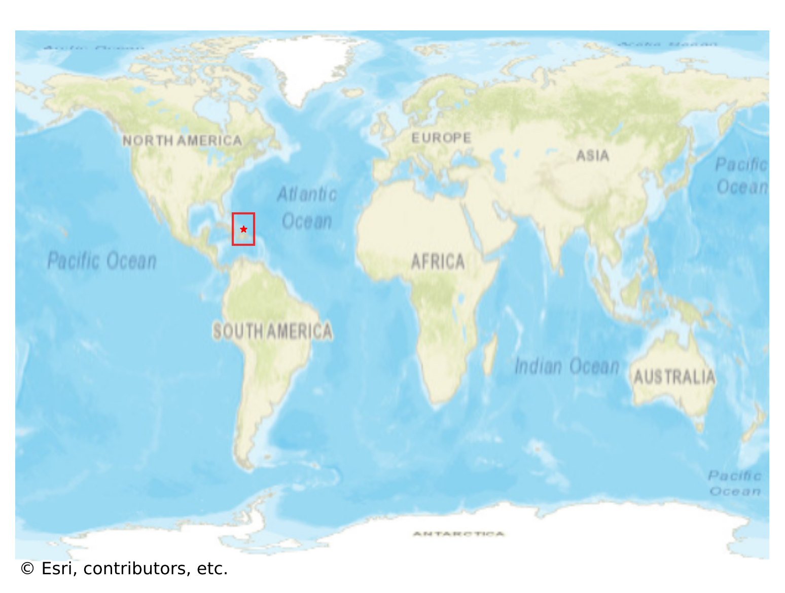
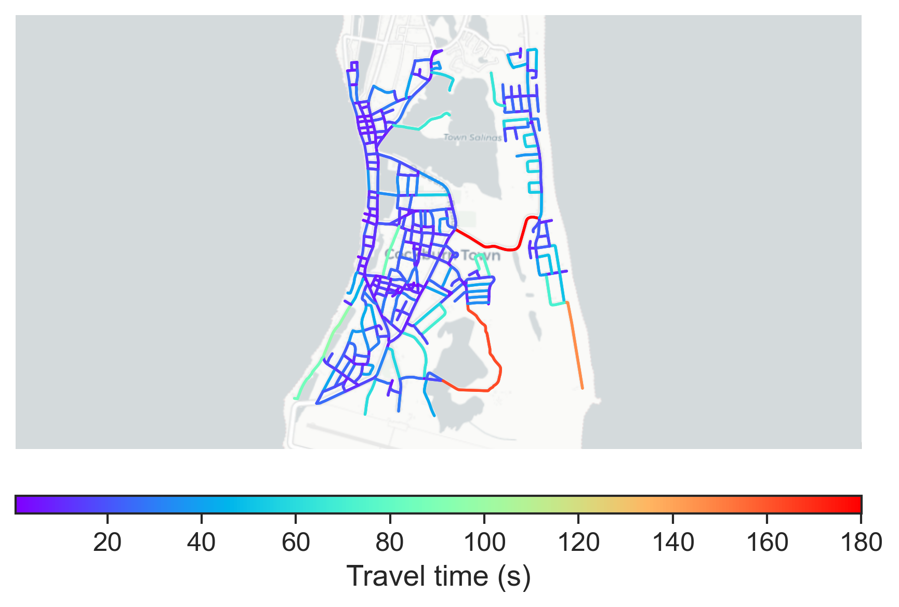

# Cockburn_Town, Turks and Caicos Islands

#### Location Information

- **City**: Cockburn_Town
- **Country**: Turks and Caicos Islands
- **Data Source**: OpenStreetMap

- **Analysis Date**: 2025-10-10

#### Road network topology

#### Network Characteristics

##### Basic Topology

- **Number of Nodes**: 352
- **Number of Edges**: 968
- **Network Density**: 0.007835
- **Average Node Degree**: 5.500
- **Standard Deviation of Node Degrees**: 1.699

##### Clustering Properties

- **Global Clustering Coefficient**: 0.038538
- **Average Local Clustering Coefficient**: 0.039957
- **Degree Assortativity Coefficient**: 0.067347

##### Spatial Metrics

- **Total Network Length (meters)**: 103564.31
- **Average Edge Length (meters)**: 106.99
- **Average Travel Time per Edge (seconds)**: 17.70

---
*Report generated on 2025-10-10 16:12:25*
