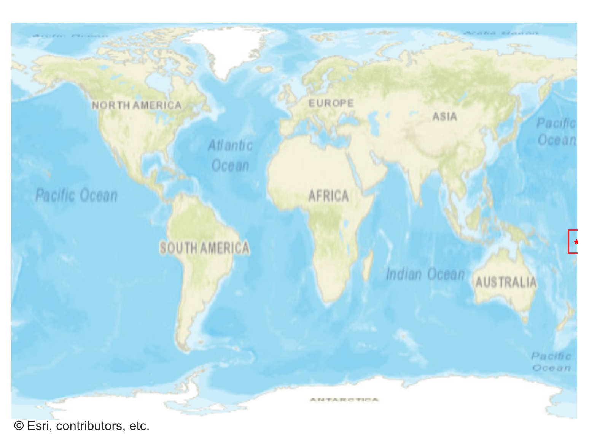
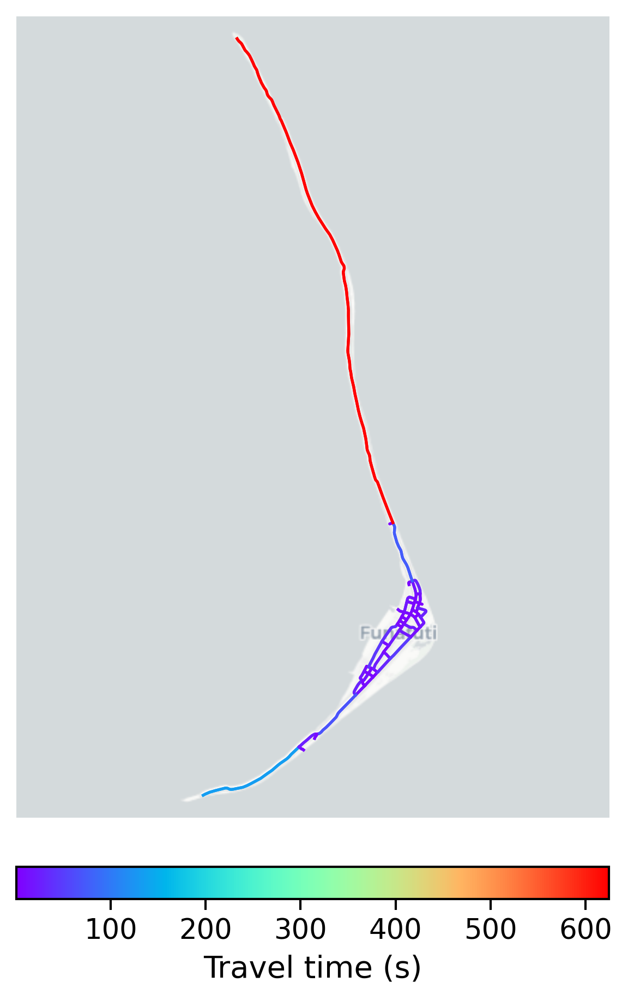

# Funafuti, Tuvalu

#### Location Information

- **City**: Funafuti
- **Country**: Tuvalu
- **Data Source**: OpenStreetMap

- **Analysis Date**: 2025-10-10

#### Road network topology

#### Network Characteristics

##### Basic Topology

- **Number of Nodes**: 52
- **Number of Edges**: 146
- **Network Density**: 0.055053
- **Average Node Degree**: 5.615
- **Standard Deviation of Node Degrees**: 1.666

##### Clustering Properties

- **Global Clustering Coefficient**: 0.060000
- **Average Local Clustering Coefficient**: 0.053030
- **Degree Assortativity Coefficient**: -0.151874

##### Spatial Metrics

- **Total Network Length (meters)**: 36062.61
- **Average Edge Length (meters)**: 247.00
- **Average Travel Time per Edge (seconds)**: 24.65

---
*Report generated on 2025-10-10 18:29:51*
