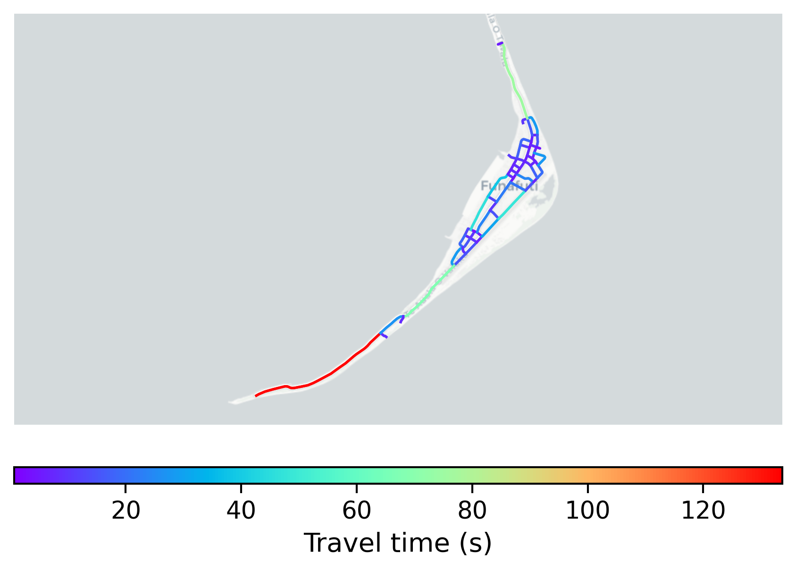

# Vaiaku, Tuvalu

#### Location Information

- **City**: Vaiaku
- **Country**: Tuvalu
- **Data Source**: OpenStreetMap

- **Analysis Date**: 2025-10-10

#### Road network topology

#### Network Characteristics

##### Basic Topology

- **Number of Nodes**: 51
- **Number of Edges**: 144
- **Network Density**: 0.056471
- **Average Node Degree**: 5.647
- **Standard Deviation of Node Degrees**: 1.619

##### Clustering Properties

- **Global Clustering Coefficient**: 0.060811
- **Average Local Clustering Coefficient**: 0.053030
- **Degree Assortativity Coefficient**: -0.120332

##### Spatial Metrics

- **Total Network Length (meters)**: 22178.55
- **Average Edge Length (meters)**: 154.02
- **Average Travel Time per Edge (seconds)**: 16.31

---
*Report generated on 2025-10-10 16:12:30*
