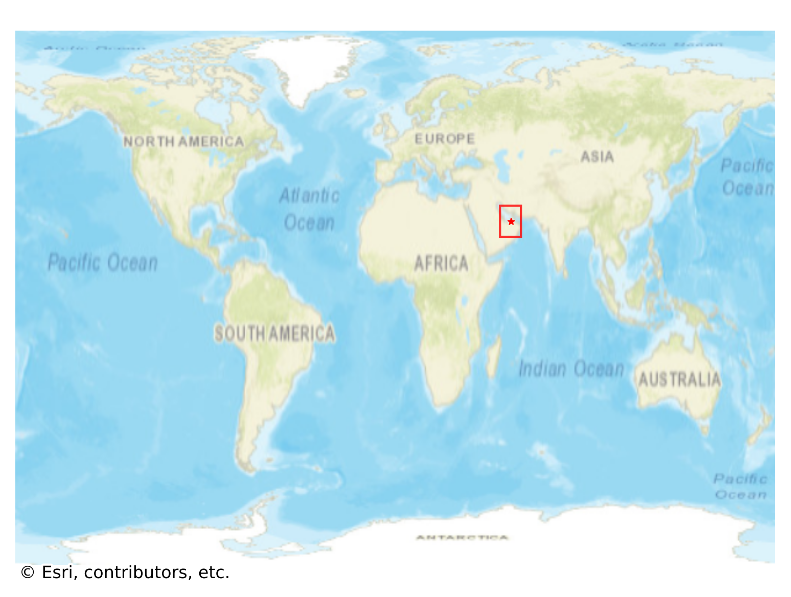
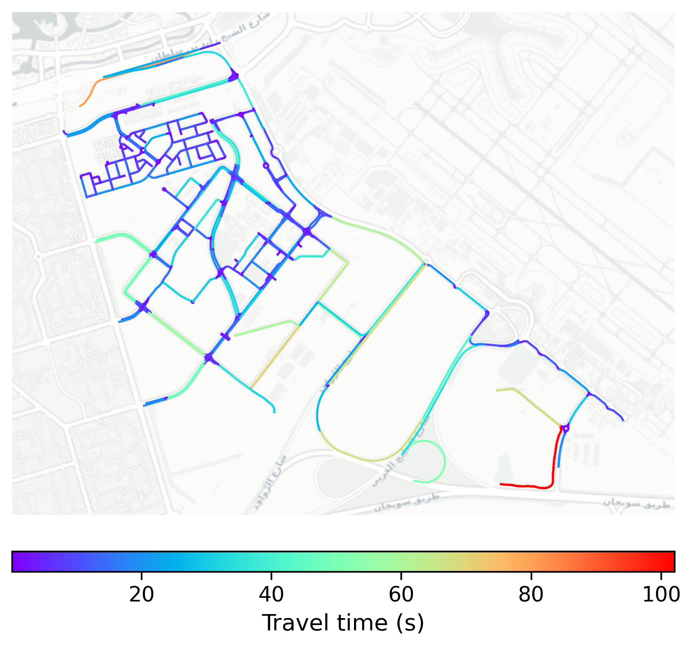

# Masdar_City, UAE

#### Location Information

- **City**: Masdar_City
- **Country**: UAE
- **Data Source**: OpenStreetMap

- **Analysis Date**: 2025-10-10

#### Road network topology

#### Network Characteristics

##### Basic Topology

- **Number of Nodes**: 468
- **Number of Edges**: 819
- **Network Density**: 0.003747
- **Average Node Degree**: 3.500
- **Standard Deviation of Node Degrees**: 1.280

##### Clustering Properties

- **Global Clustering Coefficient**: 0.166181
- **Average Local Clustering Coefficient**: 0.156659
- **Degree Assortativity Coefficient**: 0.458791

##### Spatial Metrics

- **Total Network Length (meters)**: 95350.30
- **Average Edge Length (meters)**: 116.42
- **Average Travel Time per Edge (seconds)**: 9.66

---
*Report generated on 2025-10-10 16:12:33*
