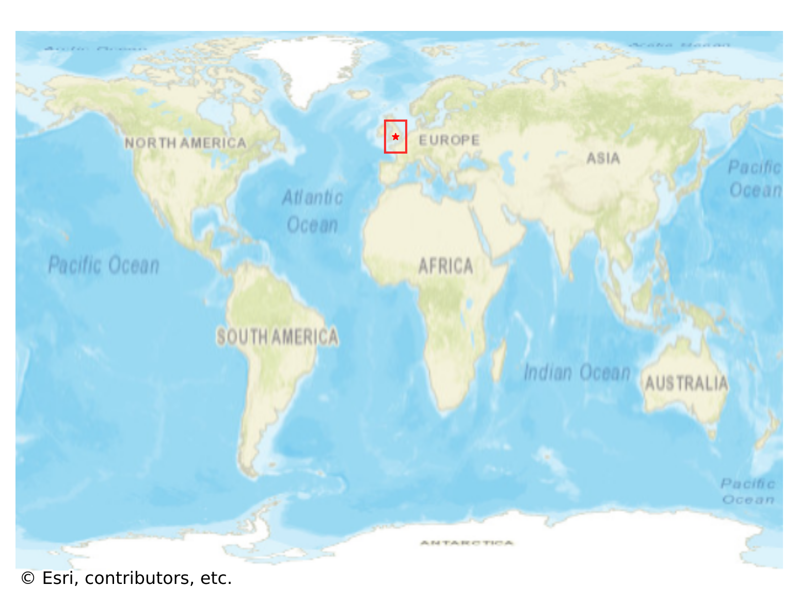
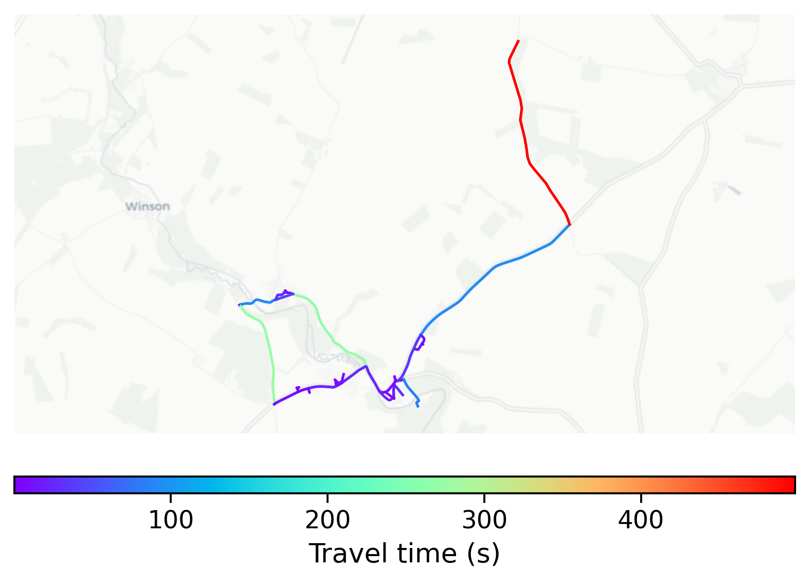

# Bibury, UK

#### Location Information

- **City**: Bibury
- **Country**: UK
- **Data Source**: OpenStreetMap

- **Analysis Date**: 2025-10-10

#### Road network topology

#### Network Characteristics

##### Basic Topology

- **Number of Nodes**: 43
- **Number of Edges**: 96
- **Network Density**: 0.053156
- **Average Node Degree**: 4.465
- **Standard Deviation of Node Degrees**: 1.809

##### Clustering Properties

- **Global Clustering Coefficient**: 0.146341
- **Average Local Clustering Coefficient**: 0.178161
- **Degree Assortativity Coefficient**: -0.118561

##### Spatial Metrics

- **Total Network Length (meters)**: 23156.17
- **Average Edge Length (meters)**: 241.21
- **Average Travel Time per Edge (seconds)**: 36.37

---
*Report generated on 2025-10-10 18:30:06*
