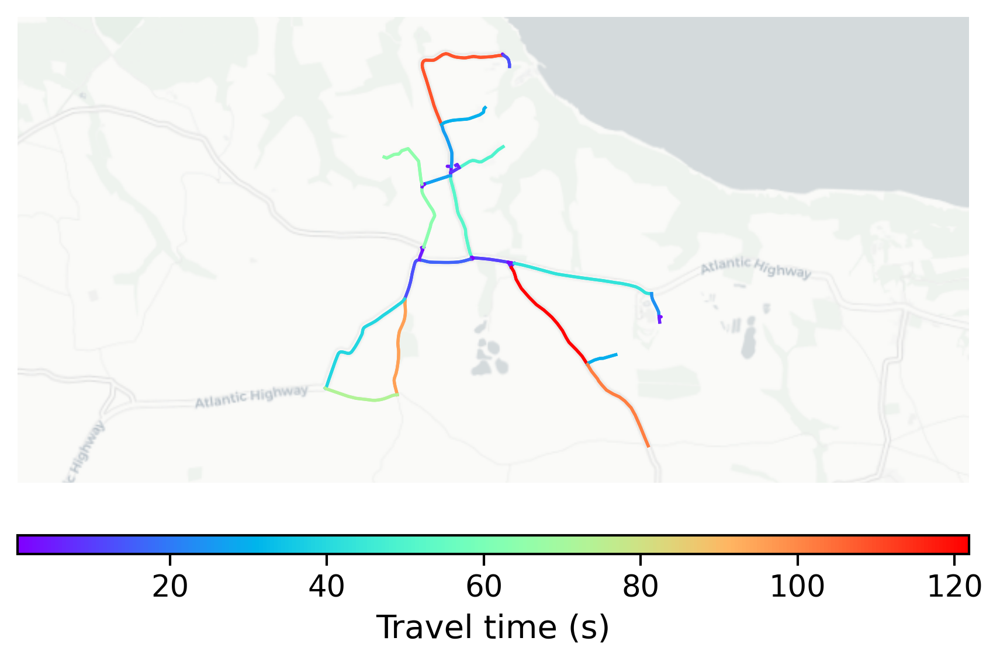

# Clovelly, UK

#### Location Information

- **City**: Clovelly
- **Country**: UK
- **Data Source**: OpenStreetMap

- **Analysis Date**: 2025-10-09

#### Road network topology

#### Network Characteristics

##### Basic Topology

- **Number of Nodes**: 36
- **Number of Edges**: 79
- **Network Density**: 0.062698
- **Average Node Degree**: 4.389
- **Standard Deviation of Node Degrees**: 1.752

##### Clustering Properties

- **Global Clustering Coefficient**: 0.223881
- **Average Local Clustering Coefficient**: 0.280000
- **Degree Assortativity Coefficient**: -0.274194

##### Spatial Metrics

- **Total Network Length (meters)**: 24293.93
- **Average Edge Length (meters)**: 307.52
- **Average Travel Time per Edge (seconds)**: 27.05

---
*Report generated on 2025-10-09 19:21:53*
