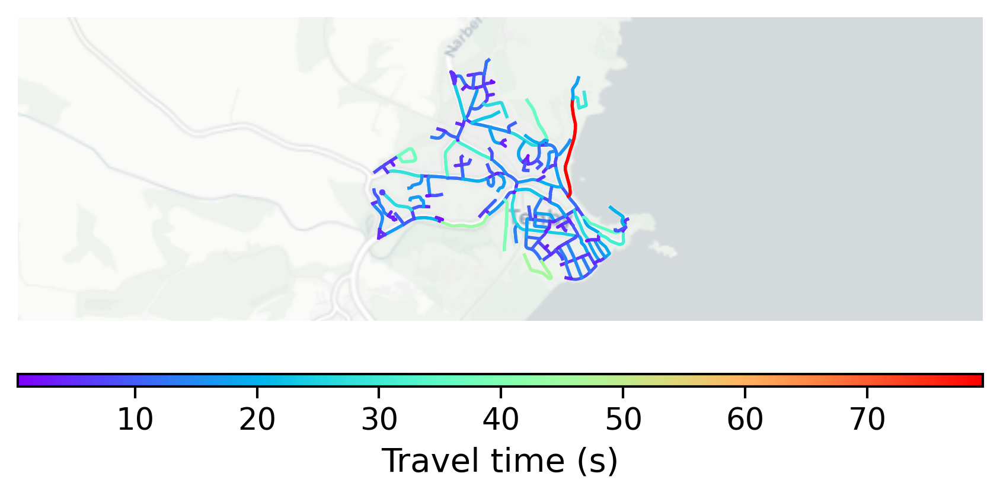

# Tenby, UK

#### Location Information

- **City**: Tenby
- **Country**: UK
- **Data Source**: OpenStreetMap

- **Analysis Date**: 2025-10-10

#### Road network topology

#### Network Characteristics

##### Basic Topology

- **Number of Nodes**: 185
- **Number of Edges**: 395
- **Network Density**: 0.011604
- **Average Node Degree**: 4.270
- **Standard Deviation of Node Degrees**: 1.866

##### Clustering Properties

- **Global Clustering Coefficient**: 0.049724
- **Average Local Clustering Coefficient**: 0.060734
- **Degree Assortativity Coefficient**: -0.181960

##### Spatial Metrics

- **Total Network Length (meters)**: 39451.08
- **Average Edge Length (meters)**: 99.88
- **Average Travel Time per Edge (seconds)**: 11.08

---
*Report generated on 2025-10-10 18:30:09*
