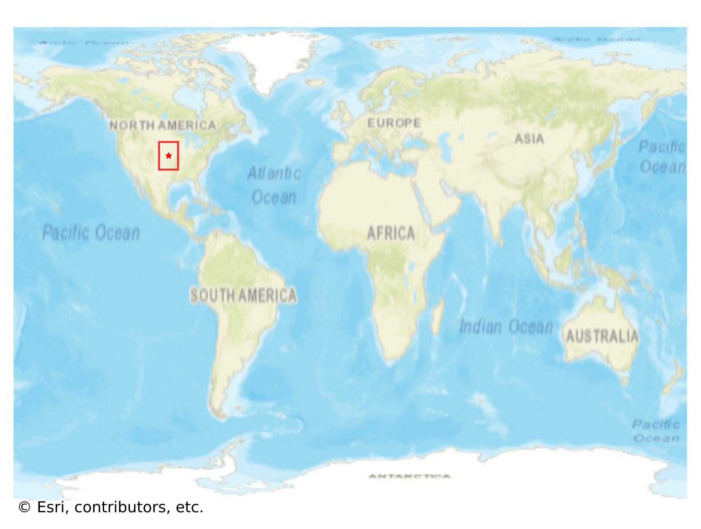

# Abilene, USA

#### Location Information

- **City**: Abilene
- **Country**: USA
- **Data Source**: OpenStreetMap

- **Analysis Date**: 2025-10-10

#### Road network topology

#### Network Characteristics

##### Basic Topology

- **Number of Nodes**: 491
- **Number of Edges**: 1,469
- **Network Density**: 0.006106
- **Average Node Degree**: 5.984
- **Standard Deviation of Node Degrees**: 1.831

##### Clustering Properties

- **Global Clustering Coefficient**: 0.025594
- **Average Local Clustering Coefficient**: 0.030445
- **Degree Assortativity Coefficient**: 0.251428

##### Spatial Metrics

- **Total Network Length (meters)**: 186934.01
- **Average Edge Length (meters)**: 127.25
- **Average Travel Time per Edge (seconds)**: 13.88

---
*Report generated on 2025-10-10 16:12:54*
