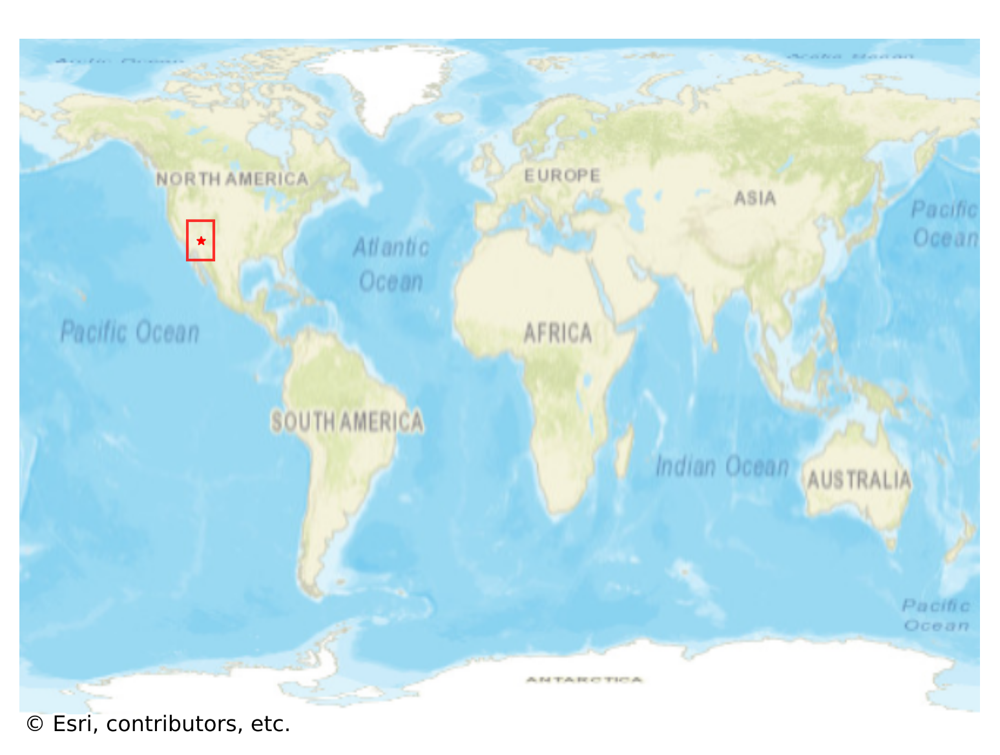
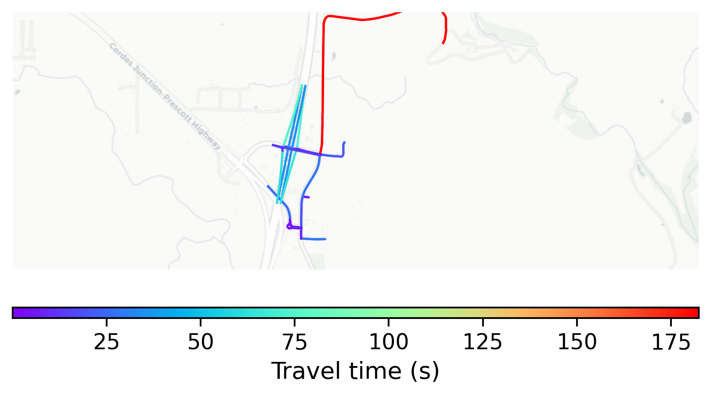

# Arcosanti, USA

#### Location Information

- **City**: Arcosanti
- **Country**: USA
- **Data Source**: OpenStreetMap

- **Analysis Date**: 2025-10-10

#### Road network topology

#### Network Characteristics

##### Basic Topology

- **Number of Nodes**: 29
- **Number of Edges**: 47
- **Network Density**: 0.057882
- **Average Node Degree**: 3.241
- **Standard Deviation of Node Degrees**: 1.330

##### Clustering Properties

- **Global Clustering Coefficient**: 0.197368
- **Average Local Clustering Coefficient**: 0.201389
- **Degree Assortativity Coefficient**: 0.180007

##### Spatial Metrics

- **Total Network Length (meters)**: 15744.21
- **Average Edge Length (meters)**: 334.98
- **Average Travel Time per Edge (seconds)**: 23.90

---
*Report generated on 2025-10-10 18:30:17*
