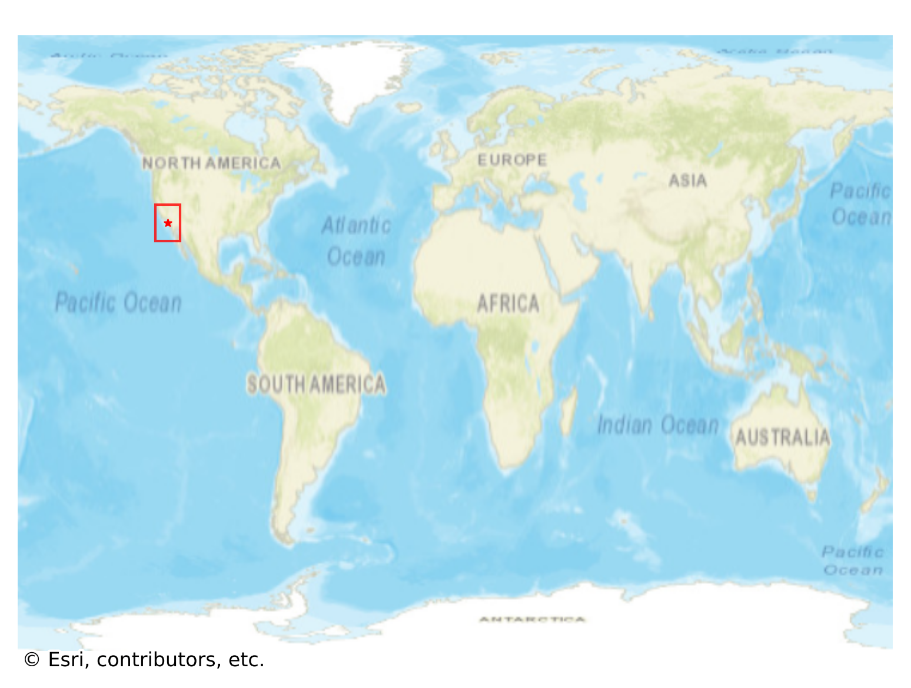
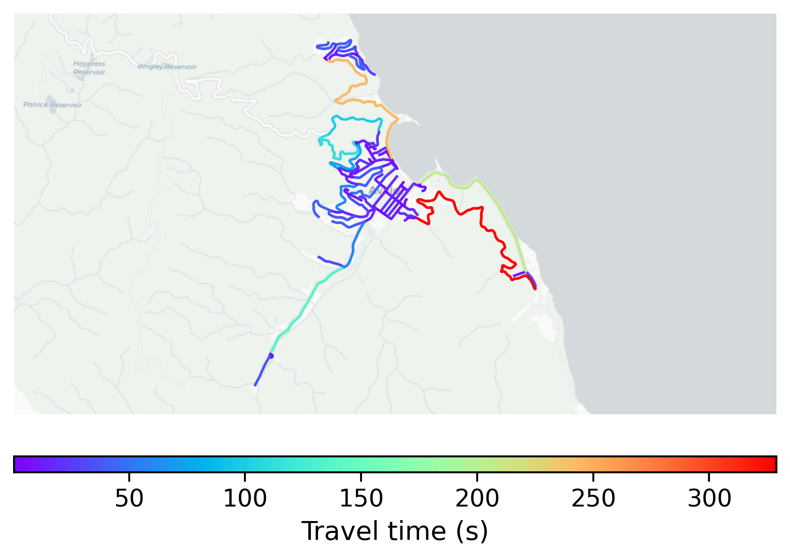

# Avalon, USA

#### Location Information

- **City**: Avalon
- **Country**: USA
- **Data Source**: OpenStreetMap

- **Analysis Date**: 2025-10-10

#### Road network topology

#### Network Characteristics

##### Basic Topology

- **Number of Nodes**: 91
- **Number of Edges**: 217
- **Network Density**: 0.026496
- **Average Node Degree**: 4.769
- **Standard Deviation of Node Degrees**: 1.846

##### Clustering Properties

- **Global Clustering Coefficient**: 0.085714
- **Average Local Clustering Coefficient**: 0.084541
- **Degree Assortativity Coefficient**: 0.025108

##### Spatial Metrics

- **Total Network Length (meters)**: 48412.19
- **Average Edge Length (meters)**: 223.10
- **Average Travel Time per Edge (seconds)**: 25.03

---
*Report generated on 2025-10-10 16:13:00*
