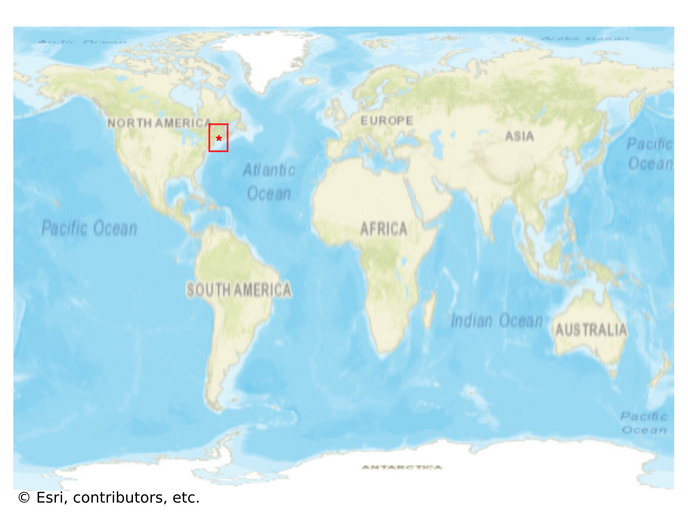
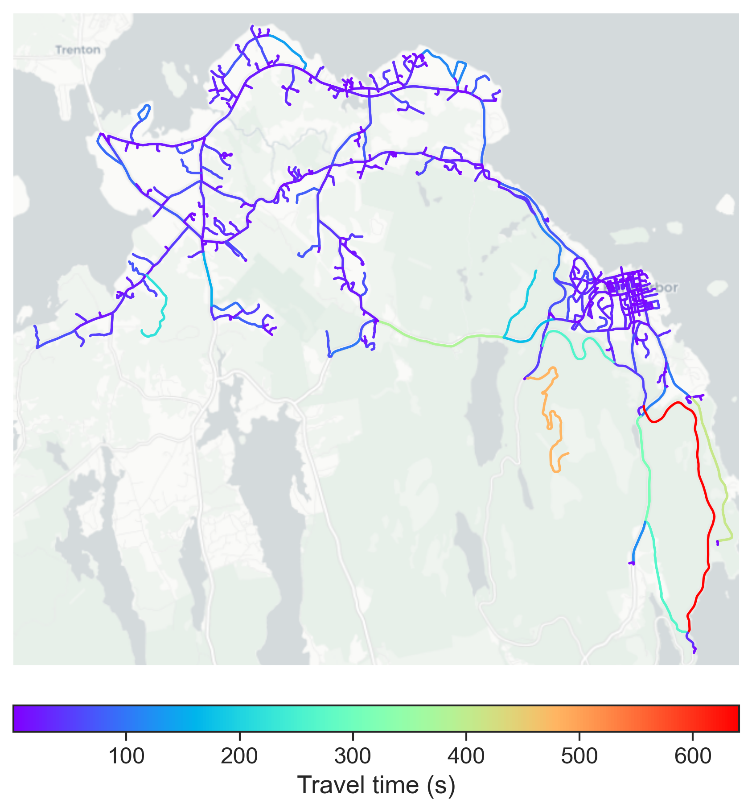

# Bar_Harbor, USA

#### Location Information

- **City**: Bar_Harbor
- **Country**: USA
- **Data Source**: OpenStreetMap

- **Analysis Date**: 2025-10-10

#### Road network topology

#### Network Characteristics

##### Basic Topology

- **Number of Nodes**: 602
- **Number of Edges**: 1,426
- **Network Density**: 0.003941
- **Average Node Degree**: 4.738
- **Standard Deviation of Node Degrees**: 1.894

##### Clustering Properties

- **Global Clustering Coefficient**: 0.062251
- **Average Local Clustering Coefficient**: 0.063570
- **Degree Assortativity Coefficient**: -0.039335

##### Spatial Metrics

- **Total Network Length (meters)**: 375792.83
- **Average Edge Length (meters)**: 263.53
- **Average Travel Time per Edge (seconds)**: 25.02

---
*Report generated on 2025-10-10 18:30:27*
