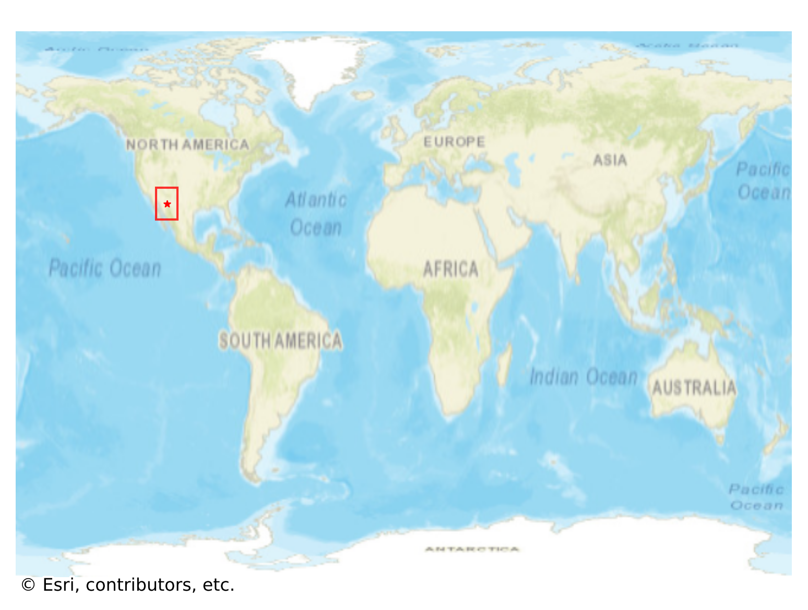

# Bisbee, USA

#### Location Information

- **City**: Bisbee
- **Country**: USA
- **Data Source**: OpenStreetMap

- **Analysis Date**: 2025-10-10

#### Road network topology

#### Network Characteristics

##### Basic Topology

- **Number of Nodes**: 523
- **Number of Edges**: 1,362
- **Network Density**: 0.004989
- **Average Node Degree**: 5.208
- **Standard Deviation of Node Degrees**: 1.981

##### Clustering Properties

- **Global Clustering Coefficient**: 0.061354
- **Average Local Clustering Coefficient**: 0.065397
- **Degree Assortativity Coefficient**: 0.180790

##### Spatial Metrics

- **Total Network Length (meters)**: 182857.62
- **Average Edge Length (meters)**: 134.26
- **Average Travel Time per Edge (seconds)**: 16.50

---
*Report generated on 2025-10-10 18:30:29*
