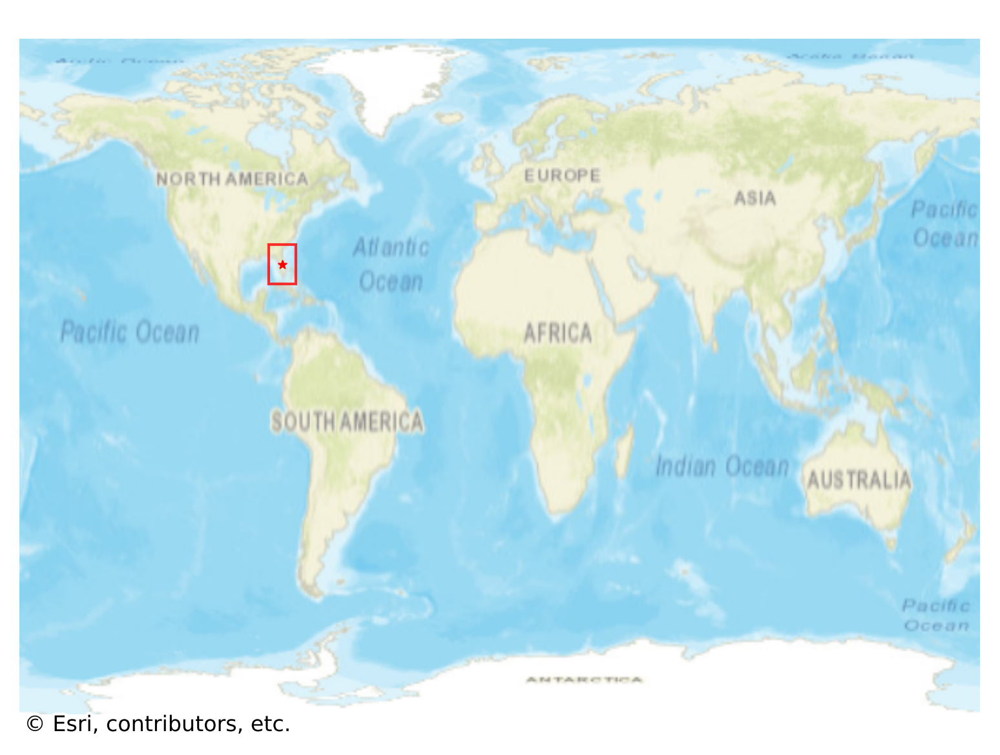

# Celebration, USA

#### Location Information

- **City**: Celebration
- **Country**: USA
- **Data Source**: OpenStreetMap

- **Analysis Date**: 2025-10-10

#### Road network topology

#### Network Characteristics

##### Basic Topology

- **Number of Nodes**: 598
- **Number of Edges**: 1,362
- **Network Density**: 0.003815
- **Average Node Degree**: 4.555
- **Standard Deviation of Node Degrees**: 1.572

##### Clustering Properties

- **Global Clustering Coefficient**: 0.093443
- **Average Local Clustering Coefficient**: 0.095803
- **Degree Assortativity Coefficient**: 0.439044

##### Spatial Metrics

- **Total Network Length (meters)**: 197842.35
- **Average Edge Length (meters)**: 145.26
- **Average Travel Time per Edge (seconds)**: 10.90

---
*Report generated on 2025-10-10 16:13:09*
