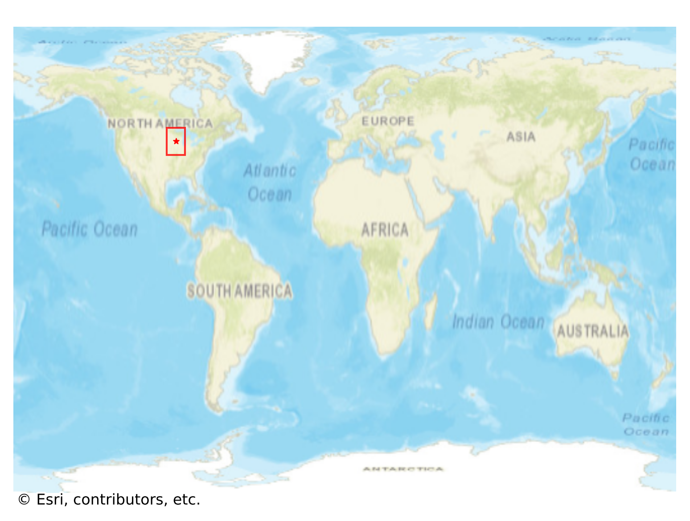

# Decorah, USA

#### Location Information

- **City**: Decorah
- **Country**: USA
- **Data Source**: OpenStreetMap

- **Analysis Date**: 2025-10-10

#### Road network topology

#### Network Characteristics

##### Basic Topology

- **Number of Nodes**: 436
- **Number of Edges**: 1,172
- **Network Density**: 0.006179
- **Average Node Degree**: 5.376
- **Standard Deviation of Node Degrees**: 2.010

##### Clustering Properties

- **Global Clustering Coefficient**: 0.061644
- **Average Local Clustering Coefficient**: 0.065622
- **Degree Assortativity Coefficient**: 0.225624

##### Spatial Metrics

- **Total Network Length (meters)**: 169101.67
- **Average Edge Length (meters)**: 144.28
- **Average Travel Time per Edge (seconds)**: 11.32

---
*Report generated on 2025-10-10 16:13:12*
