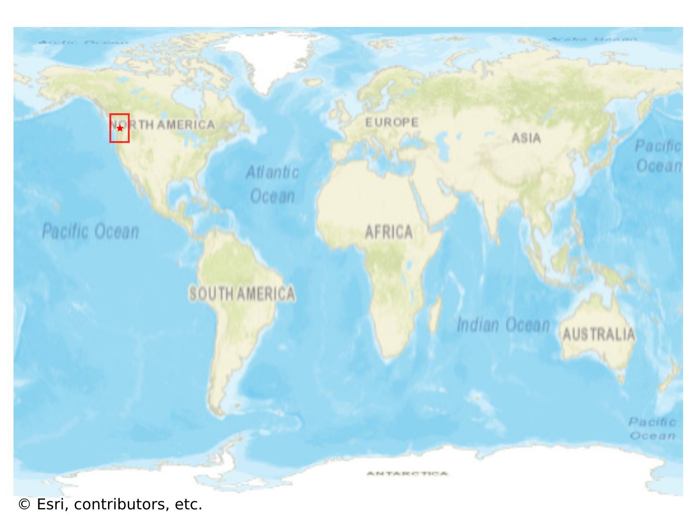
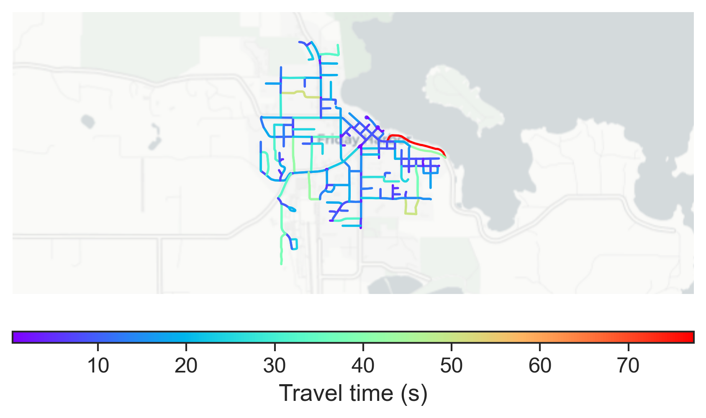

# Friday_Harbor, USA

#### Location Information

- **City**: Friday_Harbor
- **Country**: USA
- **Data Source**: OpenStreetMap

- **Analysis Date**: 2025-10-10

#### Road network topology

#### Network Characteristics

##### Basic Topology

- **Number of Nodes**: 176
- **Number of Edges**: 410
- **Network Density**: 0.013312
- **Average Node Degree**: 4.659
- **Standard Deviation of Node Degrees**: 2.083

##### Clustering Properties

- **Global Clustering Coefficient**: 0.088235
- **Average Local Clustering Coefficient**: 0.102151
- **Degree Assortativity Coefficient**: 0.005179

##### Spatial Metrics

- **Total Network Length (meters)**: 47660.40
- **Average Edge Length (meters)**: 116.24
- **Average Travel Time per Edge (seconds)**: 13.13

---
*Report generated on 2025-10-10 16:13:14*
