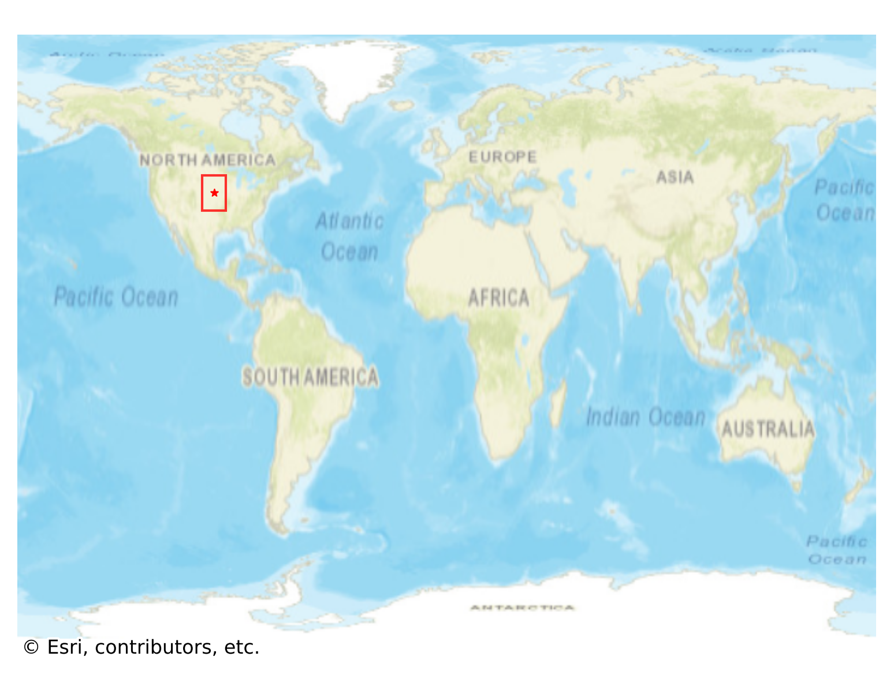

# Geneva, USA

#### Location Information

- **City**: Geneva
- **Country**: USA
- **Data Source**: OpenStreetMap

- **Analysis Date**: 2025-10-10

#### Road network topology

#### Network Characteristics

##### Basic Topology

- **Number of Nodes**: 165
- **Number of Edges**: 533
- **Network Density**: 0.019697
- **Average Node Degree**: 6.461
- **Standard Deviation of Node Degrees**: 1.642

##### Clustering Properties

- **Global Clustering Coefficient**: 0.025605
- **Average Local Clustering Coefficient**: 0.029299
- **Degree Assortativity Coefficient**: 0.377195

##### Spatial Metrics

- **Total Network Length (meters)**: 75203.14
- **Average Edge Length (meters)**: 141.09
- **Average Travel Time per Edge (seconds)**: 16.41

---
*Report generated on 2025-10-10 16:13:17*
