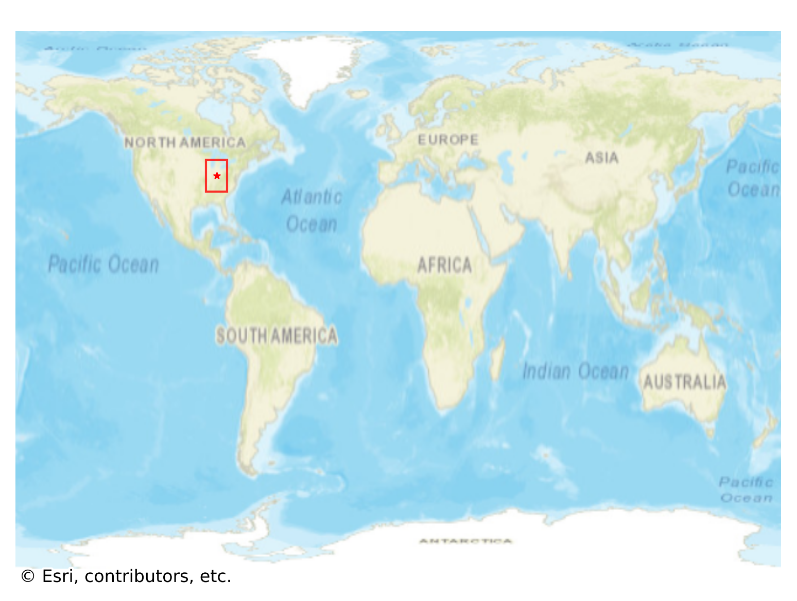
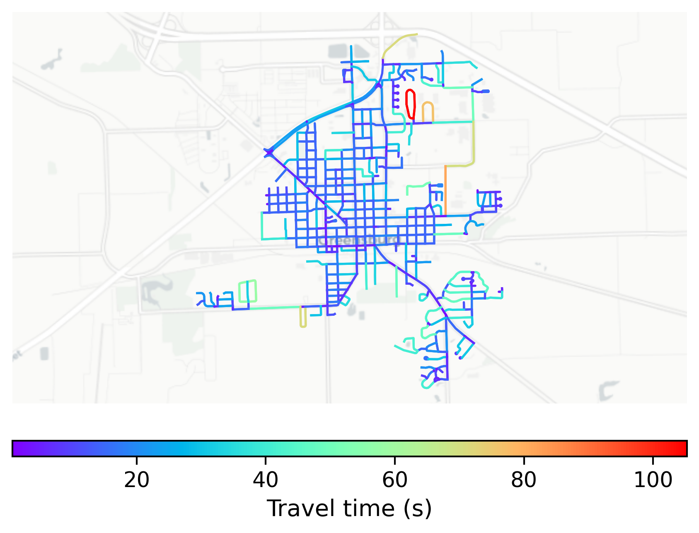

# Greensburg, USA

#### Location Information

- **City**: Greensburg
- **Country**: USA
- **Data Source**: OpenStreetMap

- **Analysis Date**: 2025-10-10

#### Road network topology

#### Network Characteristics

##### Basic Topology

- **Number of Nodes**: 437
- **Number of Edges**: 1,238
- **Network Density**: 0.006498
- **Average Node Degree**: 5.666
- **Standard Deviation of Node Degrees**: 1.868

##### Clustering Properties

- **Global Clustering Coefficient**: 0.054466
- **Average Local Clustering Coefficient**: 0.061111
- **Degree Assortativity Coefficient**: 0.129468

##### Spatial Metrics

- **Total Network Length (meters)**: 178797.27
- **Average Edge Length (meters)**: 144.42
- **Average Travel Time per Edge (seconds)**: 15.69

---
*Report generated on 2025-10-10 16:13:21*
