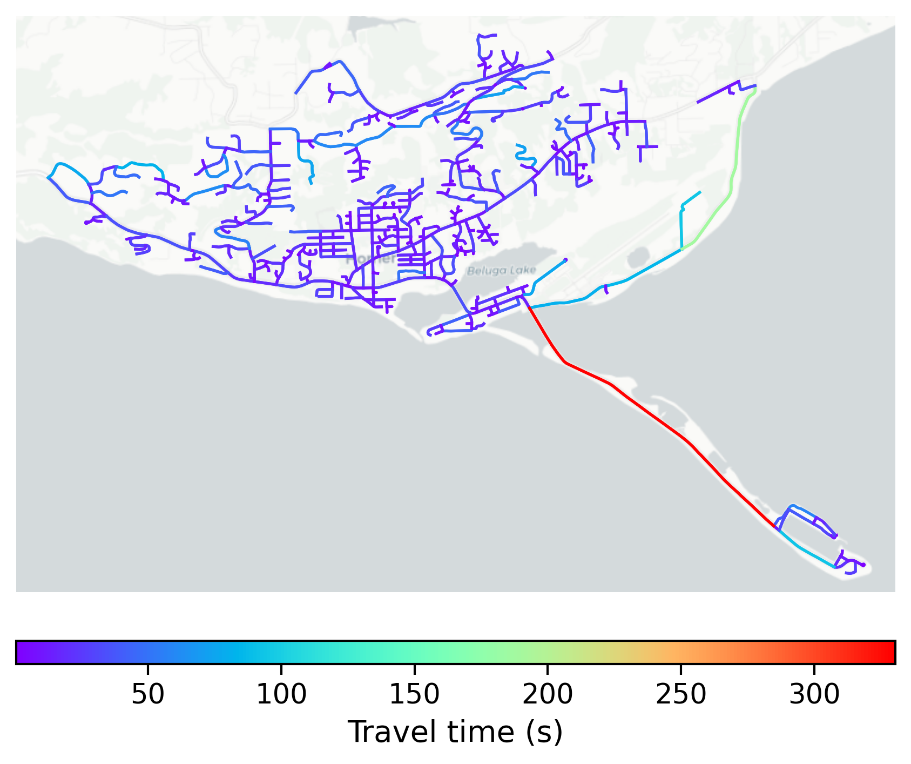

# Homer, USA

#### Location Information

- **City**: Homer
- **Country**: USA
- **Data Source**: OpenStreetMap

- **Analysis Date**: 2025-10-10

#### Road network topology

#### Network Characteristics

##### Basic Topology

- **Number of Nodes**: 534
- **Number of Edges**: 1,184
- **Network Density**: 0.004160
- **Average Node Degree**: 4.434
- **Standard Deviation of Node Degrees**: 2.072

##### Clustering Properties

- **Global Clustering Coefficient**: 0.030303
- **Average Local Clustering Coefficient**: 0.035226
- **Degree Assortativity Coefficient**: -0.183075

##### Spatial Metrics

- **Total Network Length (meters)**: 255210.12
- **Average Edge Length (meters)**: 215.55
- **Average Travel Time per Edge (seconds)**: 17.73

---
*Report generated on 2025-10-10 16:13:24*
