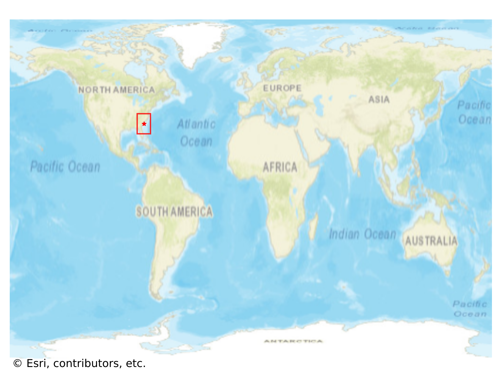
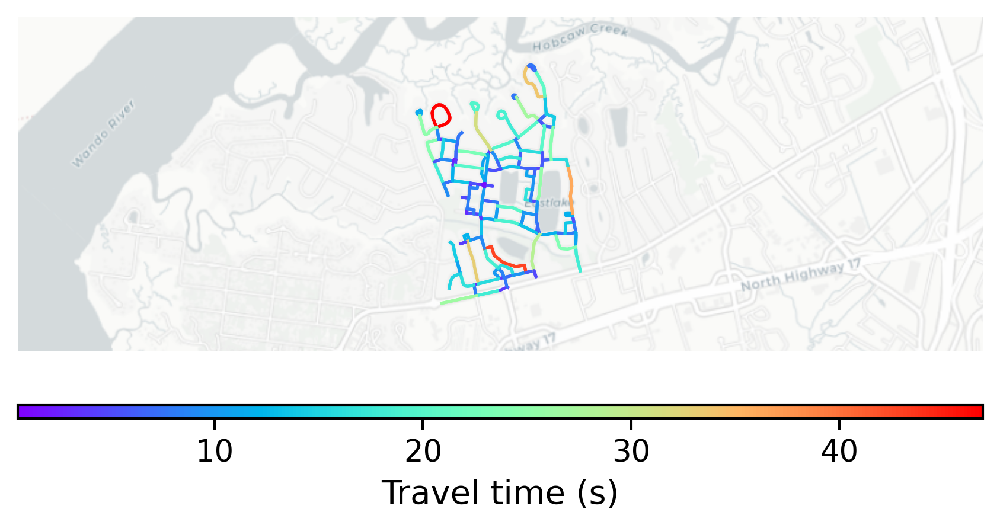

# IOn, USA

#### Location Information

- **City**: IOn
- **Country**: USA
- **Data Source**: OpenStreetMap

- **Analysis Date**: 2025-10-10

#### Road network topology

#### Network Characteristics

##### Basic Topology

- **Number of Nodes**: 109
- **Number of Edges**: 267
- **Network Density**: 0.022681
- **Average Node Degree**: 4.899
- **Standard Deviation of Node Degrees**: 1.597

##### Clustering Properties

- **Global Clustering Coefficient**: 0.101504
- **Average Local Clustering Coefficient**: 0.109319
- **Degree Assortativity Coefficient**: 0.252223

##### Spatial Metrics

- **Total Network Length (meters)**: 25625.83
- **Average Edge Length (meters)**: 95.98
- **Average Travel Time per Edge (seconds)**: 11.52

---
*Report generated on 2025-10-10 16:13:26*
