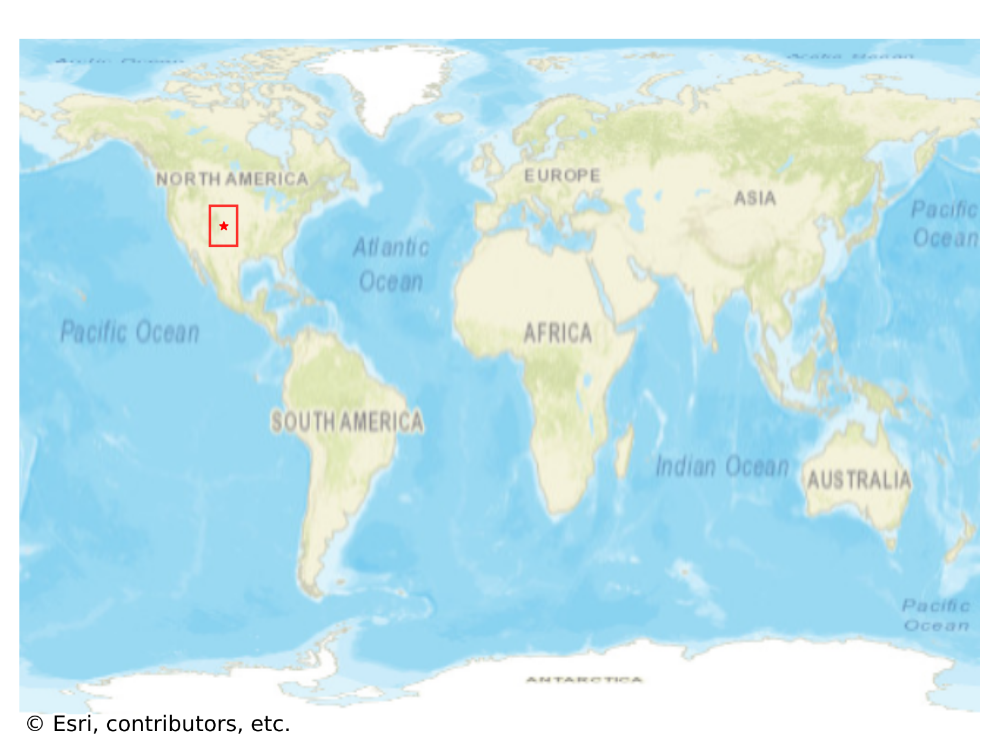
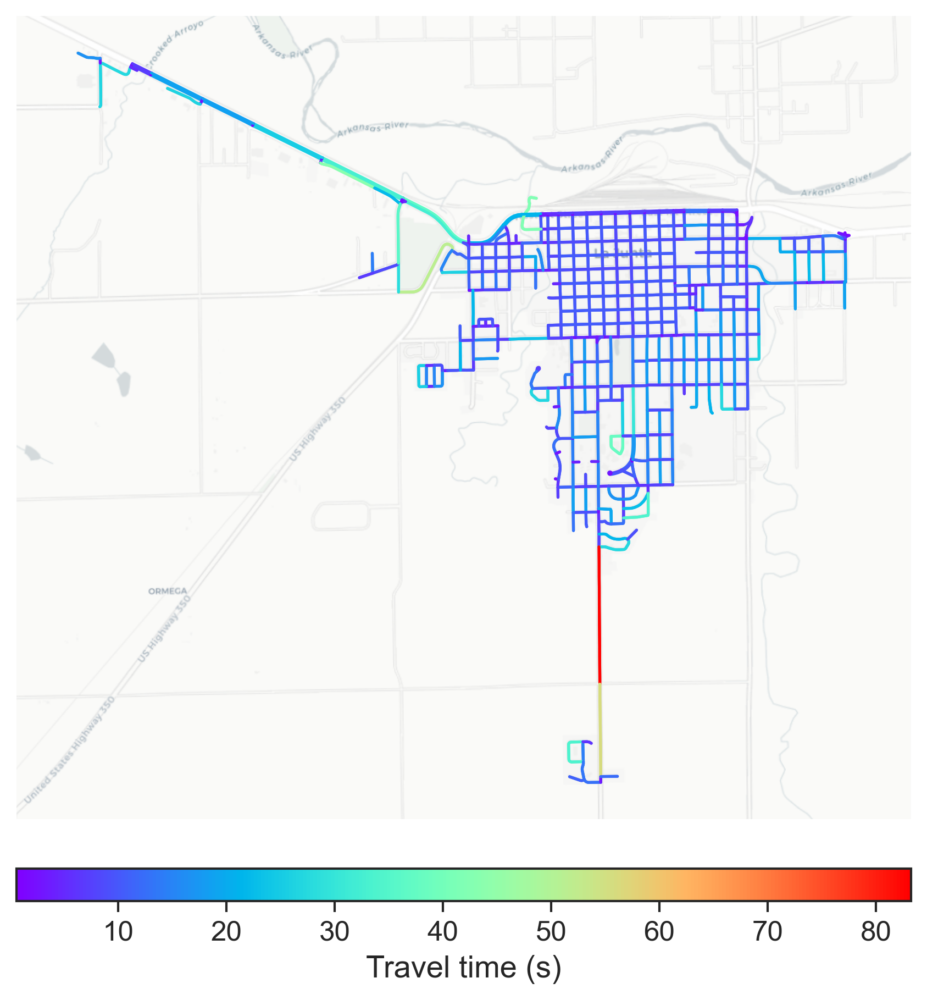

# La_Junta, USA

#### Location Information

- **City**: La_Junta
- **Country**: USA
- **Data Source**: OpenStreetMap

- **Analysis Date**: 2025-10-10

#### Road network topology

#### Network Characteristics

##### Basic Topology

- **Number of Nodes**: 417
- **Number of Edges**: 1,259
- **Network Density**: 0.007258
- **Average Node Degree**: 6.038
- **Standard Deviation of Node Degrees**: 1.900

##### Clustering Properties

- **Global Clustering Coefficient**: 0.043152
- **Average Local Clustering Coefficient**: 0.051715
- **Degree Assortativity Coefficient**: 0.369360

##### Spatial Metrics

- **Total Network Length (meters)**: 160479.23
- **Average Edge Length (meters)**: 127.47
- **Average Travel Time per Edge (seconds)**: 10.43

---
*Report generated on 2025-10-10 18:30:51*
