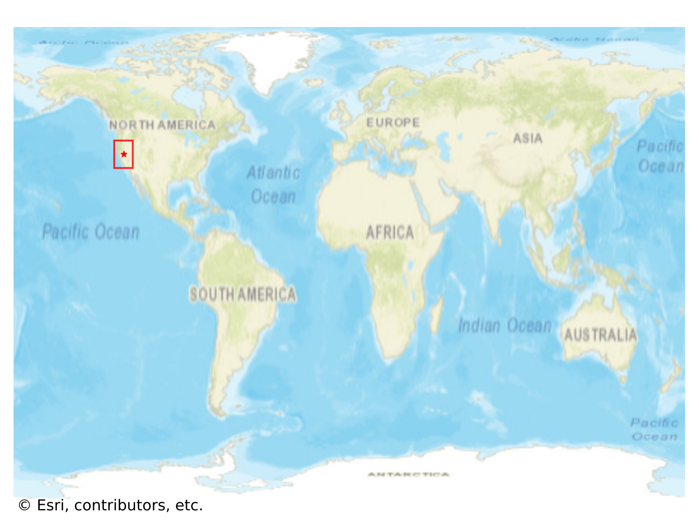
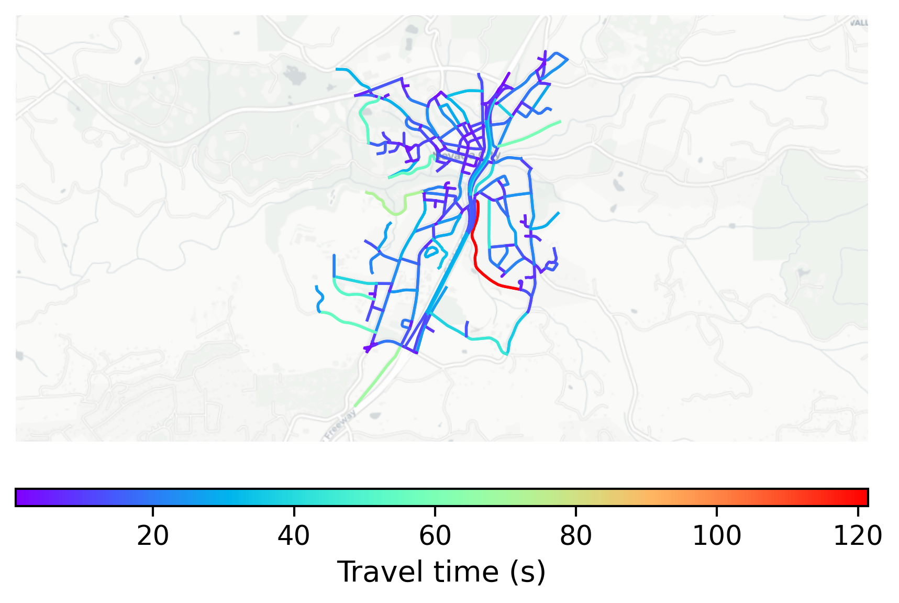

# Nevada_City, USA

#### Location Information

- **City**: Nevada_City
- **Country**: USA
- **Data Source**: OpenStreetMap

- **Analysis Date**: 2025-10-09

#### Road network topology

#### Network Characteristics

##### Basic Topology

- **Number of Nodes**: 231
- **Number of Edges**: 574
- **Network Density**: 0.010804
- **Average Node Degree**: 4.970
- **Standard Deviation of Node Degrees**: 1.815

##### Clustering Properties

- **Global Clustering Coefficient**: 0.056897
- **Average Local Clustering Coefficient**: 0.056738
- **Degree Assortativity Coefficient**: -0.016864

##### Spatial Metrics

- **Total Network Length (meters)**: 77609.67
- **Average Edge Length (meters)**: 135.21
- **Average Travel Time per Edge (seconds)**: 13.55

---
*Report generated on 2025-10-09 19:22:08*
