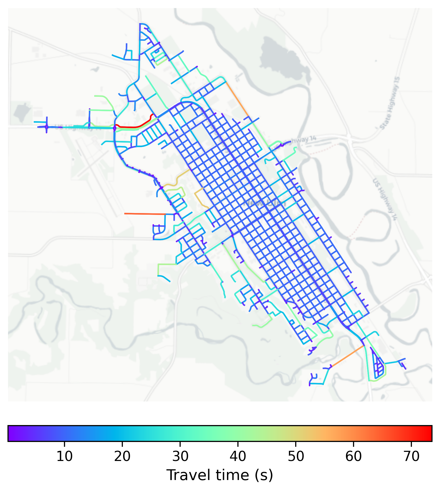

# New_Ulm, USA

#### Location Information

- **City**: New_Ulm
- **Country**: USA
- **Data Source**: OpenStreetMap

- **Analysis Date**: 2025-10-10

#### Road network topology

#### Network Characteristics

##### Basic Topology

- **Number of Nodes**: 812
- **Number of Edges**: 2,321
- **Network Density**: 0.003525
- **Average Node Degree**: 5.717
- **Standard Deviation of Node Degrees**: 1.973

##### Clustering Properties

- **Global Clustering Coefficient**: 0.044387
- **Average Local Clustering Coefficient**: 0.055126
- **Degree Assortativity Coefficient**: 0.359237

##### Spatial Metrics

- **Total Network Length (meters)**: 316658.41
- **Average Edge Length (meters)**: 136.43
- **Average Travel Time per Edge (seconds)**: 10.47

---
*Report generated on 2025-10-10 16:13:35*
