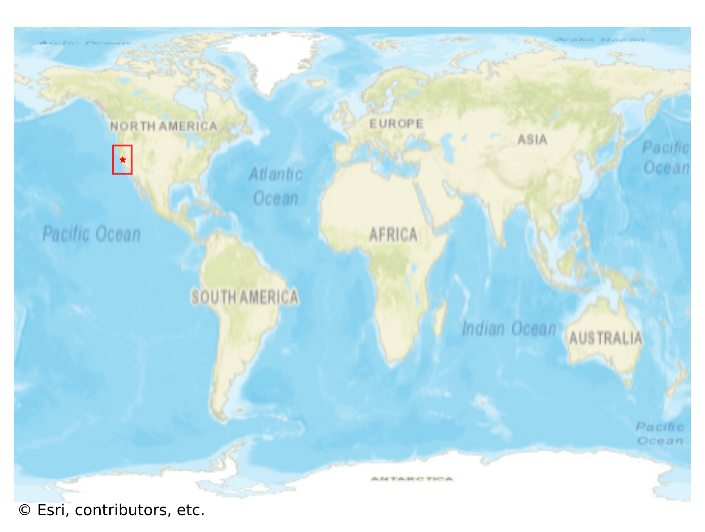
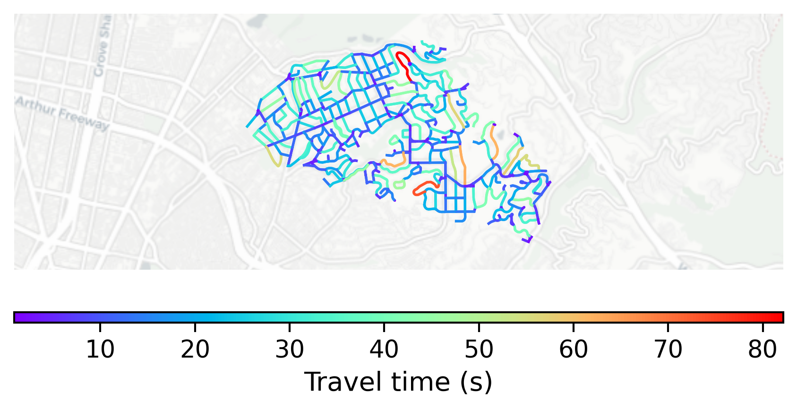

# Piedmont, USA

#### Location Information

- **City**: Piedmont
- **Country**: USA
- **Data Source**: OpenStreetMap

- **Analysis Date**: 2025-10-10

#### Road network topology

#### Network Characteristics

##### Basic Topology

- **Number of Nodes**: 352
- **Number of Edges**: 944
- **Network Density**: 0.007641
- **Average Node Degree**: 5.364
- **Standard Deviation of Node Degrees**: 1.564

##### Clustering Properties

- **Global Clustering Coefficient**: 0.103870
- **Average Local Clustering Coefficient**: 0.112879
- **Degree Assortativity Coefficient**: 0.130877

##### Spatial Metrics

- **Total Network Length (meters)**: 112049.01
- **Average Edge Length (meters)**: 118.70
- **Average Travel Time per Edge (seconds)**: 15.85

---
*Report generated on 2025-10-10 16:13:38*
