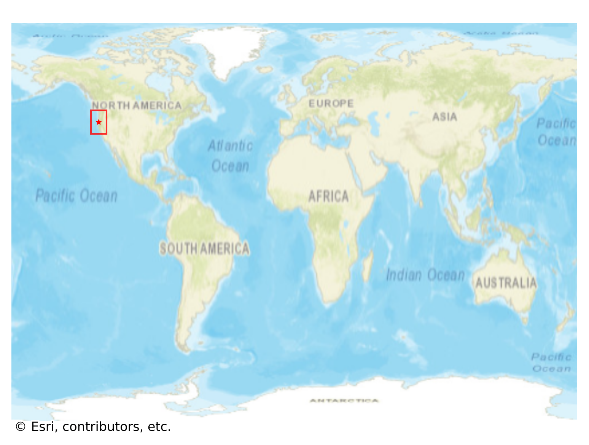

# Port_Orford, USA

#### Location Information

- **City**: Port_Orford
- **Country**: USA
- **Data Source**: OpenStreetMap

- **Analysis Date**: 2025-10-10

#### Road network topology

#### Network Characteristics

##### Basic Topology

- **Number of Nodes**: 152
- **Number of Edges**: 426
- **Network Density**: 0.018560
- **Average Node Degree**: 5.605
- **Standard Deviation of Node Degrees**: 2.213

##### Clustering Properties

- **Global Clustering Coefficient**: 0.019565
- **Average Local Clustering Coefficient**: 0.034483
- **Degree Assortativity Coefficient**: 0.112028

##### Spatial Metrics

- **Total Network Length (meters)**: 54890.98
- **Average Edge Length (meters)**: 128.85
- **Average Travel Time per Edge (seconds)**: 14.93

---
*Report generated on 2025-10-10 16:13:42*
