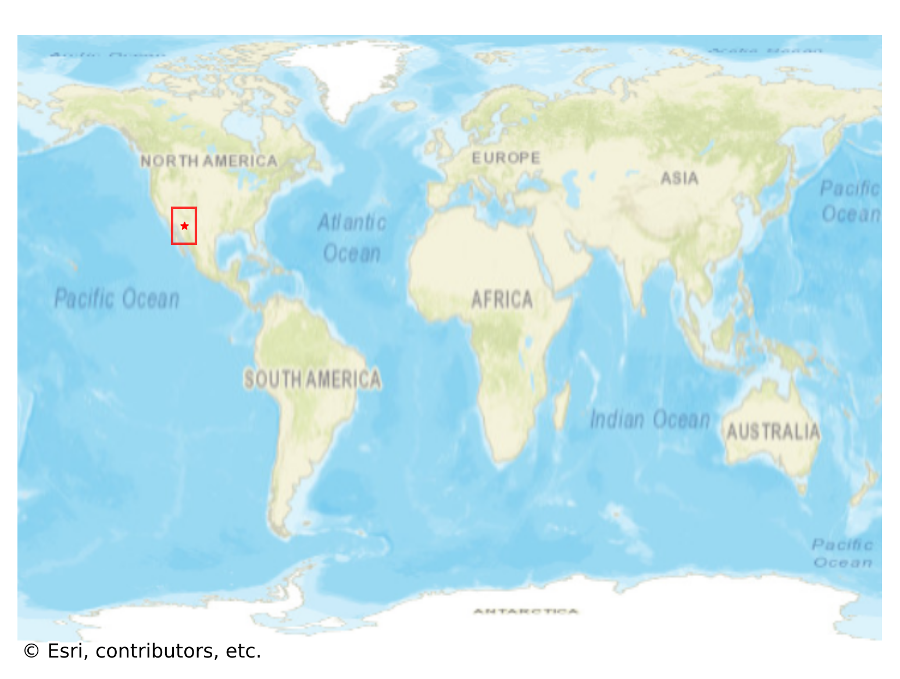
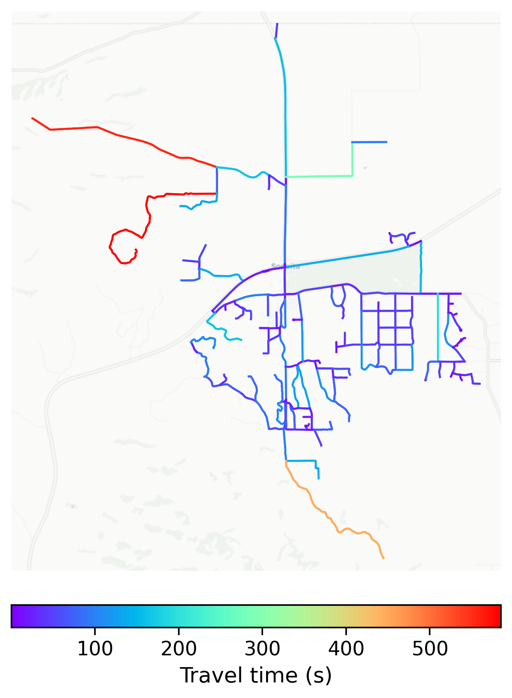

# Sonoita, USA

#### Location Information

- **City**: Sonoita
- **Country**: USA
- **Data Source**: OpenStreetMap

- **Analysis Date**: 2025-10-09

#### Road network topology

#### Network Characteristics

##### Basic Topology

- **Number of Nodes**: 159
- **Number of Edges**: 370
- **Network Density**: 0.014728
- **Average Node Degree**: 4.654
- **Standard Deviation of Node Degrees**: 1.907

##### Clustering Properties

- **Global Clustering Coefficient**: 0.049180
- **Average Local Clustering Coefficient**: 0.045171
- **Degree Assortativity Coefficient**: -0.023701

##### Spatial Metrics

- **Total Network Length (meters)**: 194751.01
- **Average Edge Length (meters)**: 526.35
- **Average Travel Time per Edge (seconds)**: 57.40

---
*Report generated on 2025-10-09 19:22:14*
