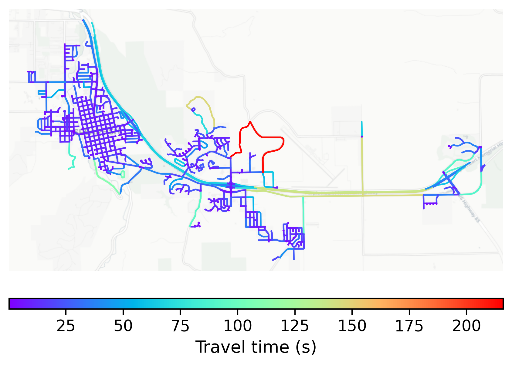

# Spearfish, USA

#### Location Information

- **City**: Spearfish
- **Country**: USA
- **Data Source**: OpenStreetMap

- **Analysis Date**: 2025-10-10

#### Road network topology

#### Network Characteristics

##### Basic Topology

- **Number of Nodes**: 721
- **Number of Edges**: 1,774
- **Network Density**: 0.003417
- **Average Node Degree**: 4.921
- **Standard Deviation of Node Degrees**: 1.970

##### Clustering Properties

- **Global Clustering Coefficient**: 0.066478
- **Average Local Clustering Coefficient**: 0.069563
- **Degree Assortativity Coefficient**: 0.219241

##### Spatial Metrics

- **Total Network Length (meters)**: 293108.19
- **Average Edge Length (meters)**: 165.22
- **Average Travel Time per Edge (seconds)**: 14.32

---
*Report generated on 2025-10-10 16:13:48*
